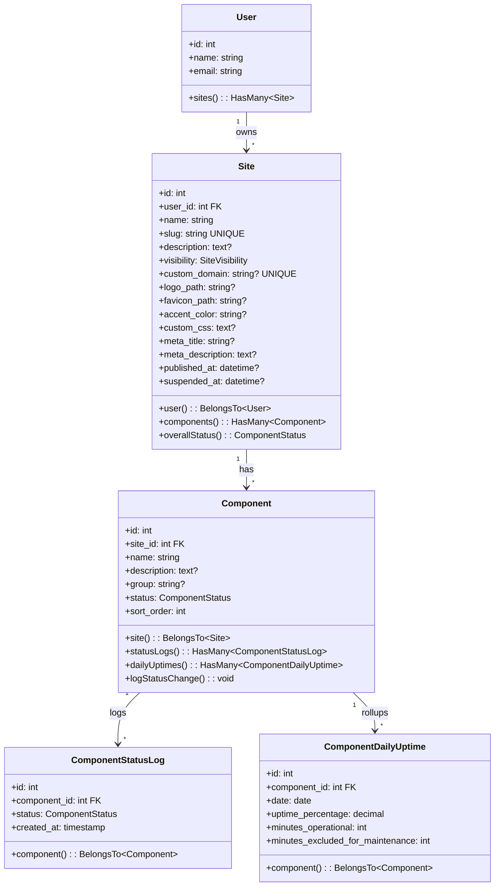

I have created the following plan after thorough exploration and analysis of the codebase. Follow the below plan verbatim. Trust the files and references. Do not re-verify what's written in the plan. Explore only when absolutely necessary. First implement all the proposed file changes and then I'll review all the changes together at the end.

---

## Observations

The codebase is a Laravel 12 + Inertia v2 + React 19 application with well-established conventions. Models use the `casts()` method (not `$casts` property), auto-increment IDs (not ULIDs/UUIDs), and explicit relationship return types. Controllers are thin and delegate business logic to Action classes in `app/Actions/`. Factories use the global `fake()` helper with named states returning `static`. Form Requests use array-style validation rules and authorize with `return true` (relying on middleware and policies). Routes are organized by domain in separate files (`auth.php`, `settings.php`, `support.php`) loaded via `require` in `routes/web.php`. Authenticated routes live under a `dashboard/` prefix with `['auth', 'verified', 'two-factor-confirmed']` middleware. The frontend uses shadcn-style components from `resources/js/components/ui/`, Wayfinder for type-safe route references, and `SharedData` types from `@/types`. Policies follow standard Laravel conventions with ownership checks via `$user->id === $model->user_id`. Enums are string-backed with TitleCase keys.

---

## Approach

This phase builds the foundational data layer for StatusKit — Sites and Components. Every subsequent phase depends on these entities. We create the full model hierarchy (Site → Component → ComponentStatusLog → ComponentDailyUptime), establish the enum-driven status system, and build the operator dashboard for managing sites and their components. The Site model includes all branding columns from day one (logo, favicon, accent color, custom CSS, meta fields) even though the branding UI details expand in later phases. Component status changes are immutably logged to `ComponentStatusLog` to support the 90-day uptime history built in Phase 4. Custom domain routing is deferred to Phase 7. The `User` model gains a `sites()` HasMany relationship.

---

## - [ ] 1. Enums

**`app/Enums/SiteVisibility.php`**

| Case | Value |
|---|---|
| Draft | `'draft'` |
| Published | `'published'` |
| Suspended | `'suspended'` |

String-backed enum. Follow the existing pattern in `app/Enums/TicketTopic.php` — `declare(strict_types=1)`, namespace `App\Enums`.

**`app/Enums/ComponentStatus.php`**

| Case | Value |
|---|---|
| Operational | `'operational'` |
| DegradedPerformance | `'degraded_performance'` |
| PartialOutage | `'partial_outage'` |
| MajorOutage | `'major_outage'` |
| UnderMaintenance | `'under_maintenance'` |

String-backed enum. Add a `label(): string` method that returns a human-readable label (e.g. `'Degraded Performance'`). Add a `color(): string` method that returns a Tailwind color token for UI rendering:
- Operational → `'green'`
- DegradedPerformance → `'yellow'`
- PartialOutage → `'orange'`
- MajorOutage → `'red'`
- UnderMaintenance → `'blue'`

Add a `severity(): int` method returning a numeric severity (0 for Operational through 4 for MajorOutage, 3 for UnderMaintenance) used to derive worst-case site status.

---

## - [ ] 2. Migrations

Create four migrations in this order so foreign keys resolve correctly. Use `php artisan make:migration` for each.

**`create_sites_table`**

| Column | Type | Notes |
|---|---|---|
| `id` | `id()` | Auto-increment primary key |
| `user_id` | `foreignId` | `constrained()->cascadeOnDelete()` |
| `name` | `string` | |
| `slug` | `string` | |
| `description` | `text` | `nullable()` |
| `visibility` | `string` | `default('draft')` — stores `SiteVisibility` enum value |
| `custom_domain` | `string` | `nullable()->unique()` |
| `logo_path` | `string` | `nullable()` |
| `favicon_path` | `string` | `nullable()` |
| `accent_color` | `string(7)` | `nullable()` — hex color e.g. `#3B82F6` |
| `custom_css` | `text` | `nullable()` |
| `meta_title` | `string` | `nullable()` |
| `meta_description` | `text` | `nullable()` |
| `published_at` | `timestamp` | `nullable()` |
| `suspended_at` | `timestamp` | `nullable()` |
| `timestamps` | | |

Add a `unique('slug')` index on `slug`. Add an index on `user_id` (auto-created by `foreignId`). Add an index on `visibility` for filtered queries.

**`create_components_table`**

| Column | Type | Notes |
|---|---|---|
| `id` | `id()` | Auto-increment primary key |
| `site_id` | `foreignId` | `constrained()->cascadeOnDelete()` |
| `name` | `string` | |
| `description` | `text` | `nullable()` |
| `group` | `string` | `nullable()` — optional category label |
| `status` | `string` | `default('operational')` — stores `ComponentStatus` enum value |
| `sort_order` | `unsignedInteger` | `default(0)` |
| `timestamps` | | |

Add a `unique(['site_id', 'name'])` composite index — component names must be unique within a site.

**`create_component_status_logs_table`**

| Column | Type | Notes |
|---|---|---|
| `id` | `id()` | Auto-increment primary key |
| `component_id` | `foreignId` | `constrained()->cascadeOnDelete()` |
| `status` | `string` | Stores `ComponentStatus` enum value |
| `created_at` | `timestamp` | `useCurrent()` |

This table is append-only (no `updated_at`). Do not use `$table->timestamps()` — only add `$table->timestamp('created_at')->useCurrent()`.

**`create_component_daily_uptimes_table`**

| Column | Type | Notes |
|---|---|---|
| `id` | `id()` | Auto-increment primary key |
| `component_id` | `foreignId` | `constrained()->cascadeOnDelete()` |
| `date` | `date` | |
| `uptime_percentage` | `decimal(5,2)` | Range 0.00–100.00 |
| `minutes_operational` | `unsignedInteger` | |
| `minutes_excluded_for_maintenance` | `unsignedInteger` | `default(0)` |
| `timestamps` | | |

Add a `unique(['component_id', 'date'])` composite index — one record per component per day.

---

## - [ ] 3. Models

**`app/Models/Site.php`**

- Traits: `HasFactory`
- `$fillable`: `user_id`, `name`, `slug`, `description`, `visibility`, `custom_domain`, `logo_path`, `favicon_path`, `accent_color`, `custom_css`, `meta_title`, `meta_description`, `published_at`, `suspended_at`
- `$hidden`: (none required)
- `casts()`:
  - `visibility` → `SiteVisibility::class`
  - `published_at` → `'datetime'`
  - `suspended_at` → `'datetime'`
- `getRouteKeyName(): string` → returns `'slug'` (sites are bound by slug in URLs)
- Relationships:
  - `user(): BelongsTo` → `User::class`
  - `components(): HasMany` → `Component::class`
- Scopes:
  - `scopePublished(Builder $query): void` — filters to `visibility = published`
  - `scopeDraft(Builder $query): void` — filters to `visibility = draft`
  - `scopeSuspended(Builder $query): void` — filters to `visibility = suspended`
  - `scopeOwnedBy(Builder $query, User $user): void` — filters to `user_id = $user->id`
- Helper methods:
  - `isPublished(): bool` — checks `visibility === SiteVisibility::Published`
  - `isDraft(): bool` — checks `visibility === SiteVisibility::Draft`
  - `isSuspended(): bool` — checks `visibility === SiteVisibility::Suspended`
  - `overallStatus(): ComponentStatus` — returns the worst-case status across all components using `ComponentStatus::severity()`. If no components exist, returns `Operational`.

**`app/Models/Component.php`**

- Traits: `HasFactory`
- `$fillable`: `site_id`, `name`, `description`, `group`, `status`, `sort_order`
- `casts()`:
  - `status` → `ComponentStatus::class`
  - `sort_order` → `'integer'`
- Relationships:
  - `site(): BelongsTo` → `Site::class`
  - `statusLogs(): HasMany` → `ComponentStatusLog::class`
  - `dailyUptimes(): HasMany` → `ComponentDailyUptime::class`
- Scopes:
  - `scopeOrdered(Builder $query): void` — orders by `sort_order` asc, then `name` asc
  - `scopeInGroup(Builder $query, string $group): void` — filters by `group`
- Helper methods:
  - `logStatusChange(): void` — creates a new `ComponentStatusLog` record with the component's current `status`. Called by `UpdateComponentStatusAction` after changing status.

**`app/Models/ComponentStatusLog.php`**

- Traits: `HasFactory`
- `$fillable`: `component_id`, `status`
- `casts()`:
  - `status` → `ComponentStatus::class`
- `const UPDATED_AT = null` — this model is immutable, no `updated_at` column
- Relationships:
  - `component(): BelongsTo` → `Component::class`

**`app/Models/ComponentDailyUptime.php`**

- Traits: `HasFactory`
- `$fillable`: `component_id`, `date`, `uptime_percentage`, `minutes_operational`, `minutes_excluded_for_maintenance`
- `casts()`:
  - `date` → `'date'`
  - `uptime_percentage` → `'decimal:2'`
  - `minutes_operational` → `'integer'`
  - `minutes_excluded_for_maintenance` → `'integer'`
- Relationships:
  - `component(): BelongsTo` → `Component::class`

**Update `app/Models/User.php`** — add one `HasMany` relationship:
- `sites(): HasMany` → `Site::class`

---

## - [ ] 4. Factories

**`database/factories/SiteFactory.php`**

Definition:
- `user_id` → `User::factory()`
- `name` → `fake()->company()`
- `slug` → `fake()->unique()->slug()`
- `description` → `fake()->sentence()`
- `visibility` → `SiteVisibility::Draft`
- `accent_color` → `fake()->hexColor()`

Named states:
- `published(): static` — sets `visibility` to `SiteVisibility::Published`, `published_at` to `now()`
- `suspended(): static` — sets `visibility` to `SiteVisibility::Suspended`, `suspended_at` to `now()`
- `withCustomDomain(): static` — sets `custom_domain` to `fake()->domainName()`

**`database/factories/ComponentFactory.php`**

Definition:
- `site_id` → `Site::factory()`
- `name` → `fake()->words(2, true)`
- `description` → `fake()->sentence()`
- `group` → `null`
- `status` → `ComponentStatus::Operational`
- `sort_order` → `0`

Named states:
- `degraded(): static` — sets `status` to `ComponentStatus::DegradedPerformance`
- `partialOutage(): static` — sets `status` to `ComponentStatus::PartialOutage`
- `majorOutage(): static` — sets `status` to `ComponentStatus::MajorOutage`
- `underMaintenance(): static` — sets `status` to `ComponentStatus::UnderMaintenance`
- `inGroup(string $group): static` — sets `group` to the given value

**`database/factories/ComponentStatusLogFactory.php`**

Definition:
- `component_id` → `Component::factory()`
- `status` → `ComponentStatus::Operational`

**`database/factories/ComponentDailyUptimeFactory.php`**

Definition:
- `component_id` → `Component::factory()`
- `date` → `fake()->date()`
- `uptime_percentage` → `fake()->randomFloat(2, 90, 100)`
- `minutes_operational` → `fake()->numberBetween(1380, 1440)`
- `minutes_excluded_for_maintenance` → `0`

---

## - [ ] 5. Seeders

**`database/seeders/SiteSeeder.php`**

Creates 2 sites for a seeded user:
1. A published site with 5 components (API, Database, Frontend, CDN, Worker) across 2 groups ("Core Services", "Infrastructure"), each with 3 status log entries spanning the last 3 days
2. A draft site with 2 components

Use factories with named states. Call `ComponentStatusLog::factory()` to seed historical entries.

Register in `DatabaseSeeder.php` so it runs after the existing UserSeeder (or create a user inline if no UserSeeder exists).

---

## - [ ] 6. Form Requests

All form requests use array-style validation rules and `authorize(): bool` returning `true` (authorization handled by policies in the controller).

**`app/Http/Requests/Sites/StoreSiteRequest.php`**

| Field | Rules |
|---|---|
| `name` | `['required', 'string', 'max:255']` |
| `slug` | `['required', 'string', 'max:255', 'alpha_dash', Rule::unique('sites', 'slug')]` |
| `description` | `['nullable', 'string', 'max:1000']` |

**`app/Http/Requests/Sites/UpdateSiteRequest.php`**

| Field | Rules |
|---|---|
| `name` | `['required', 'string', 'max:255']` |
| `slug` | `['required', 'string', 'max:255', 'alpha_dash', Rule::unique('sites', 'slug')->ignore($this->route('site'))]` |
| `description` | `['nullable', 'string', 'max:1000']` |
| `accent_color` | `['nullable', 'string', 'regex:/^#[0-9A-Fa-f]{6}$/']` |
| `meta_title` | `['nullable', 'string', 'max:255']` |
| `meta_description` | `['nullable', 'string', 'max:500']` |
| `custom_css` | `['nullable', 'string', 'max:10000']` |

**`app/Http/Requests/Sites/StoreComponentRequest.php`**

| Field | Rules |
|---|---|
| `name` | `['required', 'string', 'max:255']` |
| `description` | `['nullable', 'string', 'max:1000']` |
| `group` | `['nullable', 'string', 'max:255']` |
| `sort_order` | `['nullable', 'integer', 'min:0']` |

Add a custom rule to ensure uniqueness of `name` within the site: `Rule::unique('components', 'name')->where('site_id', $this->route('site')->id)`.

**`app/Http/Requests/Sites/UpdateComponentRequest.php`**

Same as `StoreComponentRequest` but the uniqueness rule ignores the current component: `Rule::unique('components', 'name')->where('site_id', $this->route('site')->id)->ignore($this->route('component'))`.

**`app/Http/Requests/Sites/UpdateComponentStatusRequest.php`**

| Field | Rules |
|---|---|
| `status` | `['required', Rule::enum(ComponentStatus::class)]` |

---

## - [ ] 7. Actions

**`app/Actions/Sites/CreateSiteAction.php`**

- Method: `execute(User $user, array $data): Site`
- Steps:
  1. Create the Site via `$user->sites()->create($data)` with `visibility` defaulting to `SiteVisibility::Draft`
  2. Return the created Site

**`app/Actions/Sites/UpdateSiteAction.php`**

- Method: `execute(Site $site, array $data): Site`
- Steps:
  1. Update the Site with the provided data
  2. Return the refreshed Site

**`app/Actions/Sites/DeleteSiteAction.php`**

- Method: `execute(Site $site): void`
- Steps:
  1. Delete the site (cascades to components, status logs, daily uptimes via foreign key constraints)

**`app/Actions/Sites/CreateComponentAction.php`**

- Method: `execute(Site $site, array $data): Component`
- Steps:
  1. Create the Component via `$site->components()->create($data)`
  2. Call `$component->logStatusChange()` to record the initial status in the log
  3. Return the created Component

**`app/Actions/Sites/UpdateComponentAction.php`**

- Method: `execute(Component $component, array $data): Component`
- Steps:
  1. Update the Component with the provided data (name, description, group, sort_order — NOT status)
  2. Return the refreshed Component

**`app/Actions/Sites/DeleteComponentAction.php`**

- Method: `execute(Component $component): void`
- Steps:
  1. Delete the component (cascades to status logs and daily uptimes)

**`app/Actions/Sites/UpdateComponentStatusAction.php`**

- Method: `execute(Component $component, ComponentStatus $status): Component`
- Steps:
  1. Update the component's `status` to the new value
  2. Call `$component->logStatusChange()` to create the immutable log entry
  3. Return the refreshed Component

---

## - [ ] 8. Controllers

All controllers delegate to Actions. They are in `app/Http/Controllers/Sites/`.

**`app/Http/Controllers/Sites/SiteController.php`**

Resource-style controller with authorization via `SitePolicy`.

- `index(Request $request): Response`
  1. Authorize `viewAny` via policy
  2. Query the authenticated user's sites with component count eager loaded, ordered by `created_at` desc
  3. Return `Inertia::render('sites/index', ['sites' => $sites])`

- `create(): Response`
  1. Authorize `create` via policy
  2. Return `Inertia::render('sites/create')`

- `store(StoreSiteRequest $request): RedirectResponse`
  1. Authorize `create` via policy
  2. Call `CreateSiteAction::execute($request->user(), $request->validated())`
  3. Redirect to `sites.show` with the new site's slug, flashing a success message

- `show(Site $site): Response`
  1. Authorize `view` via policy
  2. Eager load `components` ordered by `sort_order`
  3. Return `Inertia::render('sites/show', ['site' => $site])`

- `edit(Site $site): Response`
  1. Authorize `update` via policy
  2. Return `Inertia::render('sites/edit', ['site' => $site])`

- `update(UpdateSiteRequest $request, Site $site): RedirectResponse`
  1. Authorize `update` via policy
  2. Call `UpdateSiteAction::execute($site, $request->validated())`
  3. Redirect back with success message

- `destroy(Site $site): RedirectResponse`
  1. Authorize `delete` via policy
  2. Call `DeleteSiteAction::execute($site)`
  3. Redirect to `sites.index` with success message

**`app/Http/Controllers/Sites/ComponentController.php`**

Resource-style controller nested under Site. Authorization is done through the parent site's policy (user must own the site).

- `create(Site $site): Response`
  1. Authorize `update` on the Site via SitePolicy (if user can update site, they can manage components)
  2. Return `Inertia::render('sites/components/create', ['site' => $site])`

- `store(StoreComponentRequest $request, Site $site): RedirectResponse`
  1. Authorize `update` on the Site
  2. Call `CreateComponentAction::execute($site, $request->validated())`
  3. Redirect to `sites.show` with success message

- `edit(Site $site, Component $component): Response`
  1. Authorize `update` on the Site
  2. Return `Inertia::render('sites/components/edit', ['site' => $site, 'component' => $component])`

- `update(UpdateComponentRequest $request, Site $site, Component $component): RedirectResponse`
  1. Authorize `update` on the Site
  2. Call `UpdateComponentAction::execute($component, $request->validated())`
  3. Redirect back with success message

- `destroy(Site $site, Component $component): RedirectResponse`
  1. Authorize `update` on the Site
  2. Call `DeleteComponentAction::execute($component)`
  3. Redirect to `sites.show` with success message

**`app/Http/Controllers/Sites/ComponentStatusController.php`**

Invokable controller for updating a component's status independently from its other fields.

- `__invoke(UpdateComponentStatusRequest $request, Site $site, Component $component): RedirectResponse`
  1. Authorize `update` on the Site
  2. Call `UpdateComponentStatusAction::execute($component, $request->validated()['status'])`
  3. Redirect back with success message

---

## - [ ] 9. Policies

**`app/Policies/SitePolicy.php`**

Follow the pattern from `app/Policies/SupportTicketPolicy.php`.

| Method | Signature | Logic |
|---|---|---|
| `viewAny` | `(User $user): bool` | Return `true` — any authenticated user can see the sites list page |
| `view` | `(User $user, Site $site): bool` | Return `$user->id === $site->user_id` |
| `create` | `(User $user): bool` | Return `true` |
| `update` | `(User $user, Site $site): bool` | Return `$user->id === $site->user_id` |
| `delete` | `(User $user, Site $site): bool` | Return `$user->id === $site->user_id` |

---

## - [ ] 10. Routes

Create `routes/sites.php` and require it from `routes/web.php` (append `require __DIR__.'/sites.php';` after the existing requires).

**File: `routes/sites.php`**

All routes use middleware `['auth', 'verified', 'two-factor-confirmed']` and are prefixed with `dashboard/sites` with name prefix `sites.`.

| Method | URI | Controller | Route Name |
|---|---|---|---|
| GET | `dashboard/sites` | `SiteController@index` | `sites.index` |
| GET | `dashboard/sites/create` | `SiteController@create` | `sites.create` |
| POST | `dashboard/sites` | `SiteController@store` | `sites.store` |
| GET | `dashboard/sites/{site}` | `SiteController@show` | `sites.show` |
| GET | `dashboard/sites/{site}/edit` | `SiteController@edit` | `sites.edit` |
| PUT | `dashboard/sites/{site}` | `SiteController@update` | `sites.update` |
| DELETE | `dashboard/sites/{site}` | `SiteController@destroy` | `sites.destroy` |
| GET | `dashboard/sites/{site}/components/create` | `ComponentController@create` | `sites.components.create` |
| POST | `dashboard/sites/{site}/components` | `ComponentController@store` | `sites.components.store` |
| GET | `dashboard/sites/{site}/components/{component}/edit` | `ComponentController@edit` | `sites.components.edit` |
| PUT | `dashboard/sites/{site}/components/{component}` | `ComponentController@update` | `sites.components.update` |
| DELETE | `dashboard/sites/{site}/components/{component}` | `ComponentController@destroy` | `sites.components.destroy` |
| PUT | `dashboard/sites/{site}/components/{component}/status` | `ComponentStatusController` | `sites.components.status.update` |

The `{site}` parameter binds via `slug` (due to `getRouteKeyName()` on the Site model). The `{component}` parameter binds via `id` (default).

Use implicit model binding scoping so that `{component}` is automatically scoped to the parent `{site}` — Laravel handles this when both parameters are in the URL and the Child `belongsTo` the Parent.

---

## - [ ] 11. TypeScript Types

**`resources/js/types/models.ts`** (create this file or extend the existing types directory)

Define the following interfaces:

- `Site`: `id: number`, `user_id: number`, `name: string`, `slug: string`, `description: string | null`, `visibility: SiteVisibility`, `custom_domain: string | null`, `logo_path: string | null`, `favicon_path: string | null`, `accent_color: string | null`, `custom_css: string | null`, `meta_title: string | null`, `meta_description: string | null`, `published_at: string | null`, `suspended_at: string | null`, `created_at: string`, `updated_at: string`, `components?: Component[]`, `components_count?: number`

- `Component`: `id: number`, `site_id: number`, `name: string`, `description: string | null`, `group: string | null`, `status: ComponentStatus`, `sort_order: number`, `created_at: string`, `updated_at: string`

- `SiteVisibility`: union type `'draft' | 'published' | 'suspended'`

- `ComponentStatus`: union type `'operational' | 'degraded_performance' | 'partial_outage' | 'major_outage' | 'under_maintenance'`

---

## UI Design References

The following screenshots in `art/` show exactly how the UI should look. Use them as pixel references when implementing all frontend pages and components in this phase. The app uses a dark theme with a left sidebar navigation.

| Screenshot | Description |
|---|---|
| `art/dashboard.png` | Dashboard — stats cards (Sites monitored, Avg uptime, Open incidents, Sites fully operational) + multi-line response time chart |
| `art/dashboard-scrolled.png` | Dashboard (scrolled) — Sites table with uptime bars and Recent Incidents list |
| `art/sites-index.png` | Sites index — list of sites with status badge, uptime %, avg response, check interval, 90-day history bar |
| `art/site-show.png` | Site detail — current status, Uptime (30d/90d), Avg response stat cards, 90-day history bar, response time line chart, tabs for Components / Incidents / Maintenance |
| `art/components-index.png` | Components index — components grouped by group label (API, Frontend, Infrastructure) with status badge, edit/delete actions |
| `art/component-create-modal.png` | Add Component modal — Name, Description, Group, Initial status dropdown, "Show on status page" toggle |

---

## - [ ] 12. Frontend Pages

All pages use the existing dashboard layout pattern (`Page.layout = (page) => <DashboardLayout>{page}</DashboardLayout>`). Use Wayfinder imports for all route references. Use shadcn components from `@/components/ui/`.

**`resources/js/pages/sites/index.tsx`**

- Props: `{ sites: Site[] }`
- Displays a page header with title "Sites" and a "Create Site" button linking to `sites.create`
- Renders a grid/list of site cards showing: site name, slug, visibility badge (colored by state), component count, and `created_at`
- Each card links to `sites.show` for that site
- Empty state when no sites exist with a CTA to create the first site

**`resources/js/pages/sites/create.tsx`**

- Props: none
- Renders a form with fields: name (text input), slug (text input with `alpha_dash` hint), description (textarea)
- Uses `useForm` hook from Inertia with Wayfinder `store` action URL
- Submits via `post()` to `sites.store`
- Validates client-side where practical (required fields)

**`resources/js/pages/sites/show.tsx`**

- Props: `{ site: Site & { components: Component[] } }`
- Page header with site name, visibility badge, and action buttons (Edit, Delete)
- Section showing site details (slug, description, visibility)
- "Components" section:
  - "Add Component" button linking to `sites.components.create`
  - List/table of components showing: name, group, status (color-coded badge), sort order
  - Each component row has: status dropdown (for quick status change via `ComponentStatusController`), edit button, delete button
  - Components grouped by their `group` field if groups exist, otherwise flat list
  - Status changes submit via Inertia `put()` to `sites.components.status.update`

**`resources/js/pages/sites/edit.tsx`**

- Props: `{ site: Site }`
- Form with all editable site fields: name, slug, description, accent_color (color picker or hex input), meta_title, meta_description, custom_css (textarea/code editor)
- Uses `useForm` hook, submits via `put()` to `sites.update`
- Delete site button (with confirmation dialog) that submits via `delete()` to `sites.destroy`

**`resources/js/pages/sites/components/create.tsx`**

- Props: `{ site: Site }`
- Form with: name, description, group, sort_order
- Uses `useForm`, submits via `post()` to `sites.components.store`

**`resources/js/pages/sites/components/edit.tsx`**

- Props: `{ site: Site, component: Component }`
- Form matching create but pre-filled with existing values
- Uses `useForm`, submits via `put()` to `sites.components.update`
- Delete button (with confirmation) submitting via `delete()` to `sites.components.destroy`

---

## - [ ] 13. Frontend Components

**`resources/js/components/sites/site-card.tsx`**

- Props: `{ site: Site }`
- A card component used on the sites index page
- Displays site name, slug as subtitle, visibility badge, component count
- Entire card is clickable, linking to the site's show page

**`resources/js/components/sites/visibility-badge.tsx`**

- Props: `{ visibility: SiteVisibility }`
- Renders a colored badge/pill:
  - Draft → gray
  - Published → green
  - Suspended → red

**`resources/js/components/sites/component-status-badge.tsx`**

- Props: `{ status: ComponentStatus }`
- Renders a colored badge with status dot and label:
  - Operational → green
  - Degraded Performance → yellow
  - Partial Outage → orange
  - Major Outage → red
  - Under Maintenance → blue

**`resources/js/components/sites/component-status-select.tsx`**

- Props: `{ component: Component, siteSlug: string }`
- A dropdown/select that displays the current status and allows changing it
- On change, submits via Inertia `router.put()` to `sites.components.status.update` with the new status
- Uses the existing shadcn Select component from `@/components/ui/`

---

## - [ ] 14. Tests

### Unit Tests

**`tests/Unit/Models/SiteTest.php`**

- `it has correct fillable attributes`
- `it casts visibility to SiteVisibility enum`
- `it casts published_at and suspended_at to datetime`
- `it uses slug as route key name`
- `it belongs to a user`
- `it has many components`
- `it reports isPublished correctly`
- `it reports isDraft correctly`
- `it reports isSuspended correctly`
- `it computes overall status from worst component status`
- `it returns operational when no components exist`
- `it scopes to published sites`
- `it scopes to sites owned by a user`

**`tests/Unit/Models/ComponentTest.php`**

- `it has correct fillable attributes`
- `it casts status to ComponentStatus enum`
- `it belongs to a site`
- `it has many status logs`
- `it has many daily uptimes`
- `it orders by sort_order then name in ordered scope`
- `it filters by group in inGroup scope`
- `it logs status change to component_status_logs table`

**`tests/Unit/Models/ComponentStatusLogTest.php`**

- `it has no updated_at column`
- `it casts status to ComponentStatus enum`
- `it belongs to a component`

**`tests/Unit/Enums/ComponentStatusTest.php`**

- `it returns correct labels for all cases`
- `it returns correct colors for all cases`
- `it returns correct severity ordering`

**`tests/Unit/Enums/SiteVisibilityTest.php`**

- `it has correct values for all cases`

### Feature Tests

**`tests/Feature/Sites/SiteControllerTest.php`**

- `it displays sites index for authenticated user`
- `it only shows sites owned by the authenticated user`
- `it renders create site page`
- `it creates a site with valid data`
- `it rejects duplicate slugs`
- `it rejects invalid slug characters`
- `it displays site show page with components`
- `it renders edit site page`
- `it updates a site with valid data`
- `it rejects updating slug to an existing slug`
- `it deletes a site`
- `it prevents viewing another users site`
- `it prevents updating another users site`
- `it prevents deleting another users site`
- `it redirects unauthenticated users to login`
- `it redirects unverified users`

**`tests/Feature/Sites/ComponentControllerTest.php`**

- `it renders create component page`
- `it creates a component with valid data`
- `it logs initial status when creating a component`
- `it rejects duplicate component names within a site`
- `it allows same component name across different sites`
- `it renders edit component page`
- `it updates a component`
- `it deletes a component`
- `it prevents managing components of another users site`

**`tests/Feature/Sites/ComponentStatusControllerTest.php`**

- `it updates component status`
- `it logs status change when updating`
- `it rejects invalid status values`
- `it prevents updating status of another users component`

### Browser Tests

**`tests/Browser/Sites/SiteManagementTest.php`**

- `it allows a user to create a site and view it`
  - Login → navigate to sites index → click create → fill form → submit → see site show page with site name
- `it allows a user to edit a site`
  - Login → navigate to site show → click edit → modify name → submit → see updated name
- `it allows a user to add a component and change its status`
  - Login → navigate to site show → click add component → fill form → submit → see component in list → change status via dropdown → see updated status badge

---

## - [ ] 15. Data Model Diagram

