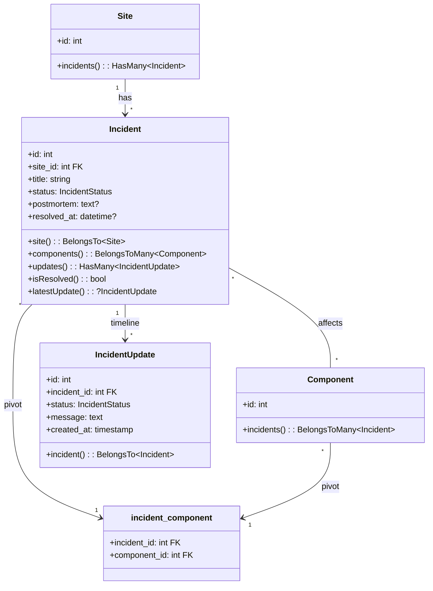
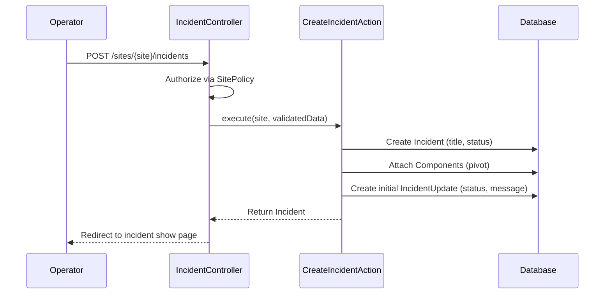
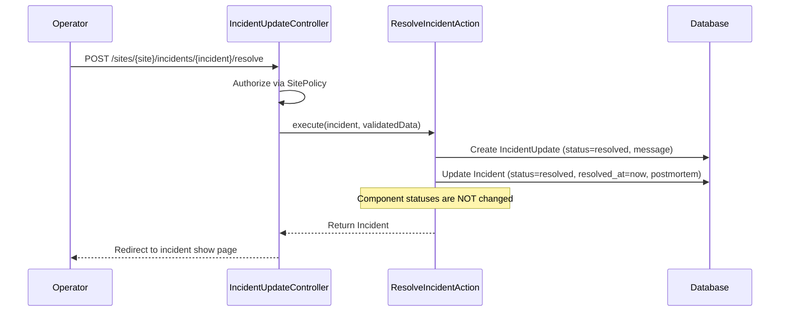

I have created the following plan after thorough exploration and analysis of the codebase. Follow the below plan verbatim. Trust the files and references. Do not re-verify what's written in the plan. Explore only when absolutely necessary. First implement all the proposed file changes and then I'll review all the changes together at the end.

---

## Observations

Phase 1 established the foundational data layer: `Site`, `Component`, `ComponentStatusLog`, and `ComponentDailyUptime` models with enums `SiteVisibility` and `ComponentStatus`. Controllers delegate to Actions in `app/Actions/Sites/`. Routes live in `routes/sites.php` under the `dashboard/sites` prefix with `['auth', 'verified', 'two-factor-confirmed']` middleware. The `Site` model uses `slug` as its route key. Factories use `fake()` and named states returning `static`. Form Requests use array-style rules.

---

## Approach

This phase adds the incident management lifecycle — the core communication tool operators use during outages. An Incident links to one or more Components via a many-to-many pivot, has a status progression (Investigating → Identified → Monitoring → Resolved), and accumulates an append-only timeline of `IncidentUpdate` records. Resolving an incident records a resolution timestamp and allows an optional postmortem note, but never mutates component statuses automatically (as specified by the PRD). The dashboard provides full CRUD for incidents plus the ability to post timeline updates. All routes are nested under the existing site routes.

---

## - [ ] 1. Enums

**`app/Enums/IncidentStatus.php`**

| Case | Value |
|---|---|
| Investigating | `'investigating'` |
| Identified | `'identified'` |
| Monitoring | `'monitoring'` |
| Resolved | `'resolved'` |

String-backed enum. Follow the pattern from `app/Enums/ComponentStatus.php`.

Add a `label(): string` method returning a human-readable label (e.g. `'Investigating'`, `'Identified'`).

Add a `color(): string` method returning a Tailwind color token:
- Investigating → `'red'`
- Identified → `'orange'`
- Monitoring → `'yellow'`
- Resolved → `'green'`

---

## - [ ] 2. Migrations

Create three migrations in order.

**`create_incidents_table`**

| Column | Type | Notes |
|---|---|---|
| `id` | `id()` | Auto-increment primary key |
| `site_id` | `foreignId` | `constrained()->cascadeOnDelete()` |
| `title` | `string` | |
| `status` | `string` | `default('investigating')` — stores `IncidentStatus` enum value |
| `postmortem` | `text` | `nullable()` — written after resolution |
| `resolved_at` | `timestamp` | `nullable()` |
| `timestamps` | | |

Add index on `site_id` (auto from `foreignId`). Add index on `status` for filtering.

**`create_incident_updates_table`**

| Column | Type | Notes |
|---|---|---|
| `id` | `id()` | Auto-increment primary key |
| `incident_id` | `foreignId` | `constrained()->cascadeOnDelete()` |
| `status` | `string` | Stores `IncidentStatus` enum value at time of update |
| `message` | `text` | The update narrative |
| `created_at` | `timestamp` | `useCurrent()` |

Append-only table — no `updated_at`. Use `$table->timestamp('created_at')->useCurrent()` only.

**`create_incident_component_table`**

| Column | Type | Notes |
|---|---|---|
| `id` | `id()` | Auto-increment primary key |
| `incident_id` | `foreignId` | `constrained()->cascadeOnDelete()` |
| `component_id` | `foreignId` | `constrained()->cascadeOnDelete()` |

Add a `unique(['incident_id', 'component_id'])` composite index.

---

## - [ ] 3. Models

**`app/Models/Incident.php`**

- Traits: `HasFactory`
- `$fillable`: `site_id`, `title`, `status`, `postmortem`, `resolved_at`
- `casts()`:
  - `status` → `IncidentStatus::class`
  - `resolved_at` → `'datetime'`
- Relationships:
  - `site(): BelongsTo` → `Site::class`
  - `components(): BelongsToMany` → `Component::class` (pivot table: `incident_component`)
  - `updates(): HasMany` → `IncidentUpdate::class`
- Scopes:
  - `scopeOpen(Builder $query): void` — filters where `status != 'resolved'`
  - `scopeResolved(Builder $query): void` — filters where `status = 'resolved'`
- Helper methods:
  - `isResolved(): bool` — checks `status === IncidentStatus::Resolved`
  - `latestUpdate(): ?IncidentUpdate` — returns the most recent update (by `created_at` desc), use via query not relationship eager load to keep it efficient

**`app/Models/IncidentUpdate.php`**

- Traits: `HasFactory`
- `$fillable`: `incident_id`, `status`, `message`
- `const UPDATED_AT = null` — immutable, no `updated_at`
- `casts()`:
  - `status` → `IncidentStatus::class`
- Relationships:
  - `incident(): BelongsTo` → `Incident::class`

**Update `app/Models/Site.php`** — add relationships:
- `incidents(): HasMany` → `Incident::class`

**Update `app/Models/Component.php`** — add relationship:
- `incidents(): BelongsToMany` → `Incident::class` (pivot table: `incident_component`)

---

## - [ ] 4. Factories

**`database/factories/IncidentFactory.php`**

Definition:
- `site_id` → `Site::factory()`
- `title` → `fake()->sentence()`
- `status` → `IncidentStatus::Investigating`

Named states:
- `identified(): static` — sets `status` to `IncidentStatus::Identified`
- `monitoring(): static` — sets `status` to `IncidentStatus::Monitoring`
- `resolved(): static` — sets `status` to `IncidentStatus::Resolved`, `resolved_at` to `now()`
- `withPostmortem(): static` — sets `postmortem` to `fake()->paragraphs(3, true)`

**`database/factories/IncidentUpdateFactory.php`**

Definition:
- `incident_id` → `Incident::factory()`
- `status` → `IncidentStatus::Investigating`
- `message` → `fake()->paragraph()`

---

## - [ ] 5. Form Requests

**`app/Http/Requests/Sites/StoreIncidentRequest.php`**

| Field | Rules |
|---|---|
| `title` | `['required', 'string', 'max:255']` |
| `status` | `['required', Rule::enum(IncidentStatus::class)]` |
| `message` | `['required', 'string', 'max:5000']` — initial timeline update message |
| `component_ids` | `['required', 'array', 'min:1']` |
| `component_ids.*` | `['required', 'integer', Rule::exists('components', 'id')->where('site_id', $this->route('site')->id)]` |

The `component_ids` validation ensures all selected components belong to the same site.

**`app/Http/Requests/Sites/UpdateIncidentRequest.php`**

| Field | Rules |
|---|---|
| `title` | `['required', 'string', 'max:255']` |
| `component_ids` | `['required', 'array', 'min:1']` |
| `component_ids.*` | `['required', 'integer', Rule::exists('components', 'id')->where('site_id', $this->route('site')->id)]` |

Does not include `status` — status is changed via incident updates, not direct edits.

**`app/Http/Requests/Sites/StoreIncidentUpdateRequest.php`**

| Field | Rules |
|---|---|
| `status` | `['required', Rule::enum(IncidentStatus::class)]` |
| `message` | `['required', 'string', 'max:5000']` |

**`app/Http/Requests/Sites/ResolveIncidentRequest.php`**

| Field | Rules |
|---|---|
| `message` | `['required', 'string', 'max:5000']` — final resolution update message |
| `postmortem` | `['nullable', 'string', 'max:10000']` |

---

## - [ ] 6. Actions

**`app/Actions/Sites/CreateIncidentAction.php`**

- Method: `execute(Site $site, array $data): Incident`
- Steps:
  1. Create the Incident on the site with `title`, `status` from the validated data
  2. Attach the components via `$incident->components()->attach($data['component_ids'])`
  3. Create the initial `IncidentUpdate` with the provided `status` and `message`
  4. Return the created Incident

**`app/Actions/Sites/UpdateIncidentAction.php`**

- Method: `execute(Incident $incident, array $data): Incident`
- Steps:
  1. Update the incident's `title`
  2. Sync the components via `$incident->components()->sync($data['component_ids'])`
  3. Return the refreshed Incident

**`app/Actions/Sites/AddIncidentUpdateAction.php`**

- Method: `execute(Incident $incident, array $data): IncidentUpdate`
- Steps:
  1. Create an `IncidentUpdate` on the incident with the provided `status` and `message`
  2. Update the incident's `status` to match the new update's status
  3. Return the created IncidentUpdate

**`app/Actions/Sites/ResolveIncidentAction.php`**

- Method: `execute(Incident $incident, array $data): Incident`
- Steps:
  1. Create a final `IncidentUpdate` with `status` = `IncidentStatus::Resolved` and the provided `message`
  2. Update the incident: set `status` to `Resolved`, `resolved_at` to `now()`, and `postmortem` to the provided value (if any)
  3. Return the refreshed Incident

Note: Resolving an incident does NOT change any component statuses. The operator must update component statuses separately if desired.

---

## - [ ] 7. Controllers

**`app/Http/Controllers/Sites/IncidentController.php`**

Resource-style controller nested under Site. All methods authorize via `SitePolicy` (user must own the site).

- `index(Site $site): Response`
  1. Authorize `view` on the Site
  2. Query incidents for the site with `updates` and `components` eager loaded, ordered by `created_at` desc
  3. Return `Inertia::render('sites/incidents/index', ['site' => $site, 'incidents' => $incidents])`

- `create(Site $site): Response`
  1. Authorize `update` on the Site
  2. Load the site's components (for the component selector)
  3. Return `Inertia::render('sites/incidents/create', ['site' => $site, 'components' => $components])`

- `store(StoreIncidentRequest $request, Site $site): RedirectResponse`
  1. Authorize `update` on the Site
  2. Call `CreateIncidentAction::execute($site, $request->validated())`
  3. Redirect to `sites.incidents.show` with success message

- `show(Site $site, Incident $incident): Response`
  1. Authorize `view` on the Site
  2. Eager load `updates` (ordered by `created_at` desc), `components`
  3. Load the site's components (for adding/removing affected components)
  4. Return `Inertia::render('sites/incidents/show', ['site' => $site, 'incident' => $incident, 'siteComponents' => $siteComponents])`

- `edit(Site $site, Incident $incident): Response`
  1. Authorize `update` on the Site
  2. Load the site's components
  3. Return `Inertia::render('sites/incidents/edit', ['site' => $site, 'incident' => $incident, 'components' => $components])`

- `update(UpdateIncidentRequest $request, Site $site, Incident $incident): RedirectResponse`
  1. Authorize `update` on the Site
  2. Call `UpdateIncidentAction::execute($incident, $request->validated())`
  3. Redirect back with success message

- `destroy(Site $site, Incident $incident): RedirectResponse`
  1. Authorize `update` on the Site
  2. Delete the incident (cascades to updates and pivot)
  3. Redirect to `sites.incidents.index` with success message

**`app/Http/Controllers/Sites/IncidentUpdateController.php`**

Handles posting timeline updates and resolving incidents.

- `store(StoreIncidentUpdateRequest $request, Site $site, Incident $incident): RedirectResponse`
  1. Authorize `update` on the Site
  2. Call `AddIncidentUpdateAction::execute($incident, $request->validated())`
  3. Redirect back with success message

- `resolve(ResolveIncidentRequest $request, Site $site, Incident $incident): RedirectResponse`
  1. Authorize `update` on the Site
  2. Call `ResolveIncidentAction::execute($incident, $request->validated())`
  3. Redirect to `sites.incidents.show` with success message

---

## - [ ] 8. Routes

Add to `routes/sites.php` inside the existing site route group.

| Method | URI | Controller | Route Name |
|---|---|---|---|
| GET | `dashboard/sites/{site}/incidents` | `IncidentController@index` | `sites.incidents.index` |
| GET | `dashboard/sites/{site}/incidents/create` | `IncidentController@create` | `sites.incidents.create` |
| POST | `dashboard/sites/{site}/incidents` | `IncidentController@store` | `sites.incidents.store` |
| GET | `dashboard/sites/{site}/incidents/{incident}` | `IncidentController@show` | `sites.incidents.show` |
| GET | `dashboard/sites/{site}/incidents/{incident}/edit` | `IncidentController@edit` | `sites.incidents.edit` |
| PUT | `dashboard/sites/{site}/incidents/{incident}` | `IncidentController@update` | `sites.incidents.update` |
| DELETE | `dashboard/sites/{site}/incidents/{incident}` | `IncidentController@destroy` | `sites.incidents.destroy` |
| POST | `dashboard/sites/{site}/incidents/{incident}/updates` | `IncidentUpdateController@store` | `sites.incidents.updates.store` |
| POST | `dashboard/sites/{site}/incidents/{incident}/resolve` | `IncidentUpdateController@resolve` | `sites.incidents.resolve` |

The `{incident}` parameter binds via `id` (default). Laravel's implicit model binding scoping ensures the incident belongs to the parent site via the `site_id` foreign key.

---

## - [ ] 9. TypeScript Types

Add to `resources/js/types/models.ts`:

- `Incident`: `id: number`, `site_id: number`, `title: string`, `status: IncidentStatus`, `postmortem: string | null`, `resolved_at: string | null`, `created_at: string`, `updated_at: string`, `components?: Component[]`, `updates?: IncidentUpdate[]`

- `IncidentUpdate`: `id: number`, `incident_id: number`, `status: IncidentStatus`, `message: string`, `created_at: string`

- `IncidentStatus`: union type `'investigating' | 'identified' | 'monitoring' | 'resolved'`

---

## UI Design References

The following screenshots in `art/` show exactly how the UI should look. Use them as pixel references when implementing all frontend pages and components in this phase.

| Screenshot | Description |
|---|---|
| `art/incidents-index.png` | Incidents index — filter tabs (All / Open / Resolved), incident rows with title, impact badge, site name, started time, latest update excerpt, status badge (Investigating / Monitoring / Resolved) |
| `art/incident-show.png` | Incident detail — Incident Timeline on the left (append-only updates with status + timestamp + message), Details panel on the right (Status, Impact, Site, Started), Affected Components panel below details (component name + severity badge) |

---

## - [ ] 10. Frontend Pages

All pages use the dashboard layout. Use Wayfinder imports for route references.

**`resources/js/pages/sites/incidents/index.tsx`**

- Props: `{ site: Site, incidents: Incident[] }`
- Page header: "Incidents" with site name as context, "Report Incident" button
- Tabs or filter for "Open" (non-resolved) and "Resolved" incidents
- Incident list showing: title, status badge (colored by `IncidentStatus`), affected component names, latest update timestamp, time since creation
- Each incident links to `sites.incidents.show`
- Empty state when no incidents

**`resources/js/pages/sites/incidents/create.tsx`**

- Props: `{ site: Site, components: Component[] }`
- Form fields:
  - Title (text input)
  - Status (select with IncidentStatus options, default: Investigating)
  - Message (textarea — the initial timeline update)
  - Affected Components (multi-select/checkbox group from available site components)
- Uses `useForm`, submits via `post()` to `sites.incidents.store`

**`resources/js/pages/sites/incidents/show.tsx`**

- Props: `{ site: Site, incident: Incident & { updates: IncidentUpdate[], components: Component[] }, siteComponents: Component[] }`
- Header: Incident title, status badge, "Edit" button
- Affected components listed as badges
- Timeline section: chronological list of `IncidentUpdate` entries, each showing status badge, message, and timestamp
- "Post Update" form (inline, below timeline):
  - Status select
  - Message textarea
  - Submit button — posts to `sites.incidents.updates.store`
- "Resolve Incident" section (only if not already resolved):
  - Message textarea (resolution message)
  - Postmortem textarea (optional)
  - Submit button — posts to `sites.incidents.resolve`
- If resolved: show postmortem section with the text, and a "Resolved at" timestamp

**`resources/js/pages/sites/incidents/edit.tsx`**

- Props: `{ site: Site, incident: Incident, components: Component[] }`
- Form with: title, affected components multi-select
- Does NOT allow changing status directly (status changes happen via timeline updates)
- Uses `useForm`, submits via `put()` to `sites.incidents.update`
- Delete button with confirmation dialog

---

## - [ ] 11. Frontend Components

**`resources/js/components/sites/incident-status-badge.tsx`**

- Props: `{ status: IncidentStatus }`
- Colored badge matching the enum's color scheme:
  - Investigating → red
  - Identified → orange
  - Monitoring → yellow
  - Resolved → green

**`resources/js/components/sites/incident-timeline.tsx`**

- Props: `{ updates: IncidentUpdate[] }`
- Renders a vertical timeline with timestamp, status badge, and message for each entry
- Most recent update at the top (reverse chronological)

**`resources/js/components/sites/component-multi-select.tsx`**

- Props: `{ components: Component[], selectedIds: number[], onChange: (ids: number[]) => void }`
- Checkbox group or multi-select dropdown for choosing affected components
- Shows component name and current status badge

---

## - [ ] 12. Tests

### Unit Tests

**`tests/Unit/Models/IncidentTest.php`**

- `it has correct fillable attributes`
- `it casts status to IncidentStatus enum`
- `it casts resolved_at to datetime`
- `it belongs to a site`
- `it has many updates`
- `it belongs to many components`
- `it scopes to open incidents`
- `it scopes to resolved incidents`
- `it reports isResolved correctly`
- `it returns latest update`

**`tests/Unit/Models/IncidentUpdateTest.php`**

- `it has no updated_at column`
- `it casts status to IncidentStatus enum`
- `it belongs to an incident`

**`tests/Unit/Enums/IncidentStatusTest.php`**

- `it has correct values for all cases`
- `it returns correct labels`
- `it returns correct colors`

### Feature Tests

**`tests/Feature/Sites/IncidentControllerTest.php`**

- `it displays incidents index for a site`
- `it only shows incidents for the specified site`
- `it renders create incident page with site components`
- `it creates an incident with valid data`
- `it attaches components to incident on creation`
- `it creates initial incident update on creation`
- `it rejects incident without components`
- `it rejects components from another site`
- `it displays incident show page with timeline`
- `it updates an incident title and components`
- `it deletes an incident`
- `it prevents managing incidents of another users site`
- `it redirects unauthenticated users`

**`tests/Feature/Sites/IncidentUpdateControllerTest.php`**

- `it adds an update to an incident`
- `it updates incident status when adding an update`
- `it resolves an incident with message`
- `it resolves an incident with postmortem`
- `it sets resolved_at when resolving`
- `it rejects empty update message`
- `it prevents updating incidents of another users site`

### Browser Tests

**`tests/Browser/Sites/IncidentManagementTest.php`**

- `it allows creating an incident with affected components`
  - Login → navigate to site → incidents → create → select components → fill title and message → submit → see incident on show page
- `it allows posting a timeline update`
  - Login → navigate to incident show → fill update form → submit → see new update in timeline
- `it allows resolving an incident with a postmortem`
  - Login → navigate to open incident → fill resolution message and postmortem → submit → see resolved badge and postmortem text

---

## - [ ] 13. Data Model Diagram

---

## - [ ] 14. Incident Creation Flow

