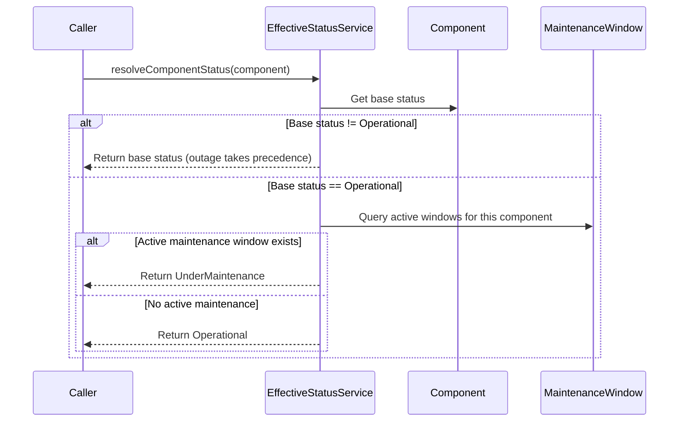
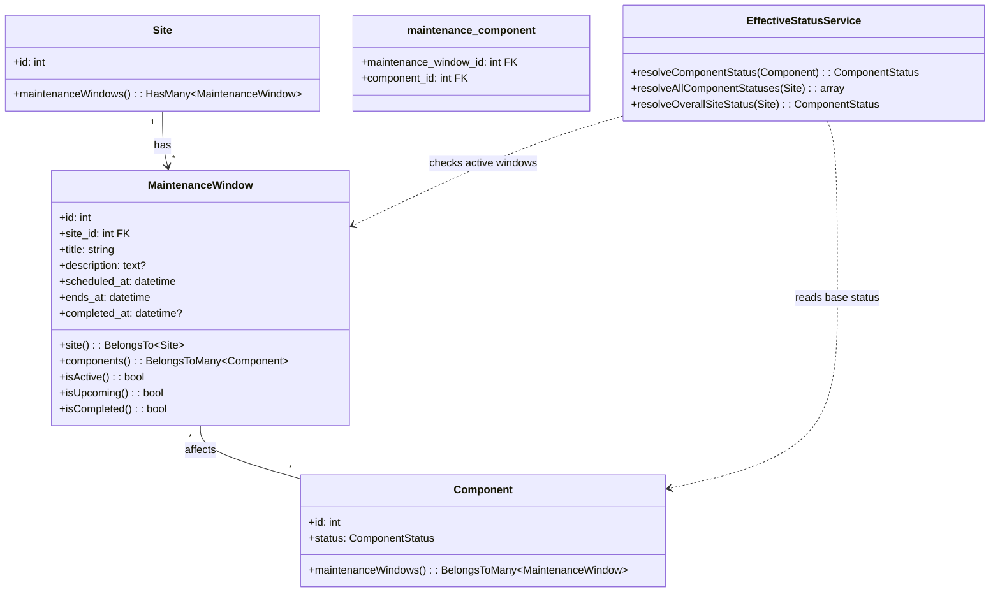

I have created the following plan after thorough exploration and analysis of the codebase. Follow the below plan verbatim. Trust the files and references. Do not re-verify what's written in the plan. Explore only when absolutely necessary. First implement all the proposed file changes and then I'll review all the changes together at the end.

---

## Observations

Phase 1 established `Site`, `Component`, `ComponentStatusLog`, and `ComponentDailyUptime` with enums `SiteVisibility` and `ComponentStatus`. Phase 2 added `Incident`, `IncidentUpdate`, and the `incident_component` pivot. All controllers delegate to Actions. The `Component` model stores a `status` field representing the operator-controlled base status. The `ComponentStatus` enum includes `UnderMaintenance` as a possible base status value. Form Requests use array-style rules. Routes live in `routes/sites.php` under `dashboard/sites` prefix.

---

## Approach

This phase introduces maintenance windows and the effective status resolution logic — the deterministic model that decides what status the public sees for each component. A `MaintenanceWindow` links to one or more Components via a many-to-many pivot, has a scheduled start/end time, and can be completed manually or auto-completed when the end time passes. The `EffectiveStatusService` implements the PRD's precedence rules: the base status is always operator-controlled; active maintenance windows overlay `under_maintenance` only when the base status is `operational`. A scheduled artisan command runs every minute to auto-complete expired windows. The dashboard provides CRUD for maintenance windows.

---

## - [ ] 1. Migrations

Create two migrations in order.

**`create_maintenance_windows_table`**

| Column | Type | Notes |
|---|---|---|
| `id` | `id()` | Auto-increment primary key |
| `site_id` | `foreignId` | `constrained()->cascadeOnDelete()` |
| `title` | `string` | |
| `description` | `text` | `nullable()` |
| `scheduled_at` | `timestamp` | When the maintenance starts |
| `ends_at` | `timestamp` | When the maintenance ends |
| `completed_at` | `timestamp` | `nullable()` — set when actually completed (manually or auto) |
| `timestamps` | | |

Add index on `['site_id', 'scheduled_at']` for querying upcoming windows. Add index on `['ends_at', 'completed_at']` for the auto-complete command.

**`create_maintenance_component_table`**

| Column | Type | Notes |
|---|---|---|
| `id` | `id()` | Auto-increment primary key |
| `maintenance_window_id` | `foreignId` | `constrained()->cascadeOnDelete()` |
| `component_id` | `foreignId` | `constrained()->cascadeOnDelete()` |

Add a `unique(['maintenance_window_id', 'component_id'])` composite index.

---

## - [ ] 2. Models

**`app/Models/MaintenanceWindow.php`**

- Traits: `HasFactory`
- `$fillable`: `site_id`, `title`, `description`, `scheduled_at`, `ends_at`, `completed_at`
- `casts()`:
  - `scheduled_at` → `'datetime'`
  - `ends_at` → `'datetime'`
  - `completed_at` → `'datetime'`
- Relationships:
  - `site(): BelongsTo` → `Site::class`
  - `components(): BelongsToMany` → `Component::class` (pivot table: `maintenance_component`)
- Scopes:
  - `scopeActive(Builder $query): void` — filters where `scheduled_at <= now()` AND `ends_at > now()` AND `completed_at IS NULL`
  - `scopeUpcoming(Builder $query): void` — filters where `scheduled_at > now()` AND `completed_at IS NULL`
  - `scopeCompleted(Builder $query): void` — filters where `completed_at IS NOT NULL`
  - `scopeExpired(Builder $query): void` — filters where `ends_at <= now()` AND `completed_at IS NULL` (for auto-complete)
- Helper methods:
  - `isActive(): bool` — returns true if `scheduled_at <= now()` AND `ends_at > now()` AND `completed_at IS NULL`
  - `isUpcoming(): bool` — returns true if `scheduled_at > now()` AND `completed_at IS NULL`
  - `isCompleted(): bool` — returns true if `completed_at IS NOT NULL`

**Update `app/Models/Site.php`** — add relationship:
- `maintenanceWindows(): HasMany` → `MaintenanceWindow::class`

**Update `app/Models/Component.php`** — add relationship:
- `maintenanceWindows(): BelongsToMany` → `MaintenanceWindow::class` (pivot table: `maintenance_component`)

---

## - [ ] 3. Factories

**`database/factories/MaintenanceWindowFactory.php`**

Definition:
- `site_id` → `Site::factory()`
- `title` → `fake()->sentence(3)`
- `description` → `fake()->paragraph()`
- `scheduled_at` → `now()->addDay()`
- `ends_at` → `now()->addDay()->addHours(2)`

Named states:
- `active(): static` — sets `scheduled_at` to `now()->subHour()`, `ends_at` to `now()->addHour()`
- `completed(): static` — sets `scheduled_at` to `now()->subHours(3)`, `ends_at` to `now()->subHour()`, `completed_at` to `now()->subHour()`
- `expired(): static` — sets `scheduled_at` to `now()->subHours(3)`, `ends_at` to `now()->subHour()`, `completed_at` to `null` (for testing auto-complete)
- `upcoming(): static` — sets `scheduled_at` to `now()->addDay()`, `ends_at` to `now()->addDay()->addHours(2)`

---

## - [ ] 4. Service: EffectiveStatusService

**`app/Services/EffectiveStatusService.php`**

This is the core status resolution logic described in the PRD. It computes the public-facing status for a given component.

- Method: `resolveComponentStatus(Component $component): ComponentStatus`
- Logic:
  1. Get the component's base status (the operator-controlled `status` field)
  2. If the base status is NOT `Operational`, return the base status as-is (outage states always take precedence over maintenance)
  3. If the base status IS `Operational`, check if the component has any currently active maintenance windows (using the `MaintenanceWindow::scopeActive` scope)
  4. If an active maintenance window exists for this component, return `ComponentStatus::UnderMaintenance`
  5. Otherwise, return `ComponentStatus::Operational`

- Method: `resolveAllComponentStatuses(Site $site): array`
- Returns an associative array of `[component_id => ComponentStatus]` for all components in the site
- Steps:
  1. Load all components for the site
  2. Load all currently active maintenance windows for the site with their component IDs
  3. For each component, apply the resolution logic above
  4. Return the map

- Method: `resolveOverallSiteStatus(Site $site): ComponentStatus`
- Steps:
  1. Call `resolveAllComponentStatuses($site)` to get effective statuses
  2. Return the worst-case status using `ComponentStatus::severity()` comparison
  3. If no components exist, return `ComponentStatus::Operational`

---

## - [ ] 5. Form Requests

**`app/Http/Requests/Sites/StoreMaintenanceWindowRequest.php`**

| Field | Rules |
|---|---|
| `title` | `['required', 'string', 'max:255']` |
| `description` | `['nullable', 'string', 'max:5000']` |
| `scheduled_at` | `['required', 'date', 'after:now']` |
| `ends_at` | `['required', 'date', 'after:scheduled_at']` |
| `component_ids` | `['required', 'array', 'min:1']` |
| `component_ids.*` | `['required', 'integer', Rule::exists('components', 'id')->where('site_id', $this->route('site')->id)]` |

**`app/Http/Requests/Sites/UpdateMaintenanceWindowRequest.php`**

| Field | Rules |
|---|---|
| `title` | `['required', 'string', 'max:255']` |
| `description` | `['nullable', 'string', 'max:5000']` |
| `scheduled_at` | `['required', 'date']` |
| `ends_at` | `['required', 'date', 'after:scheduled_at']` |
| `component_ids` | `['required', 'array', 'min:1']` |
| `component_ids.*` | `['required', 'integer', Rule::exists('components', 'id')->where('site_id', $this->route('site')->id)]` |

Note: `scheduled_at` does not have `after:now` on update because the window may have already started.

---

## - [ ] 6. Actions

**`app/Actions/Sites/ScheduleMaintenanceAction.php`**

- Method: `execute(Site $site, array $data): MaintenanceWindow`
- Steps:
  1. Create the MaintenanceWindow on the site with `title`, `description`, `scheduled_at`, `ends_at`
  2. Attach the components via `$window->components()->attach($data['component_ids'])`
  3. Return the created MaintenanceWindow

**`app/Actions/Sites/UpdateMaintenanceAction.php`**

- Method: `execute(MaintenanceWindow $window, array $data): MaintenanceWindow`
- Steps:
  1. Update the window's `title`, `description`, `scheduled_at`, `ends_at`
  2. Sync components via `$window->components()->sync($data['component_ids'])`
  3. Return the refreshed MaintenanceWindow

**`app/Actions/Sites/CompleteMaintenanceAction.php`**

- Method: `execute(MaintenanceWindow $window): MaintenanceWindow`
- Steps:
  1. Set `completed_at` to `now()`
  2. Save the window
  3. Return the refreshed MaintenanceWindow

**`app/Actions/Sites/DeleteMaintenanceAction.php`**

- Method: `execute(MaintenanceWindow $window): void`
- Steps:
  1. Delete the maintenance window (cascades to pivot via foreign key)

---

## - [ ] 7. Command: CompleteExpiredMaintenance

**`app/Console/Commands/CompleteExpiredMaintenanceCommand.php`**

Create via `php artisan make:command CompleteExpiredMaintenanceCommand`.

- Signature: `maintenance:complete-expired`
- Description: `"Complete maintenance windows that have passed their end time"`
- Logic:
  1. Query all `MaintenanceWindow` records using the `expired` scope (`ends_at <= now()` AND `completed_at IS NULL`)
  2. For each expired window, set `completed_at` to the `ends_at` value (not `now()`, to accurately reflect when it should have ended)
  3. Log the count of completed windows

Register in `routes/console.php`:
- Schedule to run `everyMinute()`

---

## - [ ] 8. Controllers

**`app/Http/Controllers/Sites/MaintenanceWindowController.php`**

Resource-style controller nested under Site. Authorization via SitePolicy.

- `index(Site $site): Response`
  1. Authorize `view` on the Site
  2. Query maintenance windows for the site with `components` eager loaded, split into upcoming/active and completed, ordered by `scheduled_at`
  3. Return `Inertia::render('sites/maintenance/index', ['site' => $site, 'upcoming' => $upcoming, 'active' => $active, 'completed' => $completed])`

- `create(Site $site): Response`
  1. Authorize `update` on the Site
  2. Load the site's components
  3. Return `Inertia::render('sites/maintenance/create', ['site' => $site, 'components' => $components])`

- `store(StoreMaintenanceWindowRequest $request, Site $site): RedirectResponse`
  1. Authorize `update` on the Site
  2. Call `ScheduleMaintenanceAction::execute($site, $request->validated())`
  3. Redirect to `sites.maintenance.index` with success message

- `show(Site $site, MaintenanceWindow $maintenanceWindow): Response`
  1. Authorize `view` on the Site
  2. Eager load `components`
  3. Return `Inertia::render('sites/maintenance/show', ['site' => $site, 'maintenanceWindow' => $maintenanceWindow])`

- `edit(Site $site, MaintenanceWindow $maintenanceWindow): Response`
  1. Authorize `update` on the Site
  2. Load the site's components
  3. Return `Inertia::render('sites/maintenance/edit', ['site' => $site, 'maintenanceWindow' => $maintenanceWindow, 'components' => $components])`

- `update(UpdateMaintenanceWindowRequest $request, Site $site, MaintenanceWindow $maintenanceWindow): RedirectResponse`
  1. Authorize `update` on the Site
  2. Call `UpdateMaintenanceAction::execute($maintenanceWindow, $request->validated())`
  3. Redirect back with success message

- `destroy(Site $site, MaintenanceWindow $maintenanceWindow): RedirectResponse`
  1. Authorize `update` on the Site
  2. Call `DeleteMaintenanceAction::execute($maintenanceWindow)`
  3. Redirect to `sites.maintenance.index` with success message

**`app/Http/Controllers/Sites/CompleteMaintenanceController.php`**

Invokable controller for manually completing a maintenance window early.

- `__invoke(Site $site, MaintenanceWindow $maintenanceWindow): RedirectResponse`
  1. Authorize `update` on the Site
  2. Call `CompleteMaintenanceAction::execute($maintenanceWindow)`
  3. Redirect back with success message

---

## - [ ] 9. Routes

Add to `routes/sites.php` inside the existing site route group.

| Method | URI | Controller | Route Name |
|---|---|---|---|
| GET | `dashboard/sites/{site}/maintenance` | `MaintenanceWindowController@index` | `sites.maintenance.index` |
| GET | `dashboard/sites/{site}/maintenance/create` | `MaintenanceWindowController@create` | `sites.maintenance.create` |
| POST | `dashboard/sites/{site}/maintenance` | `MaintenanceWindowController@store` | `sites.maintenance.store` |
| GET | `dashboard/sites/{site}/maintenance/{maintenanceWindow}` | `MaintenanceWindowController@show` | `sites.maintenance.show` |
| GET | `dashboard/sites/{site}/maintenance/{maintenanceWindow}/edit` | `MaintenanceWindowController@edit` | `sites.maintenance.edit` |
| PUT | `dashboard/sites/{site}/maintenance/{maintenanceWindow}` | `MaintenanceWindowController@update` | `sites.maintenance.update` |
| DELETE | `dashboard/sites/{site}/maintenance/{maintenanceWindow}` | `MaintenanceWindowController@destroy` | `sites.maintenance.destroy` |
| POST | `dashboard/sites/{site}/maintenance/{maintenanceWindow}/complete` | `CompleteMaintenanceController` | `sites.maintenance.complete` |

---

## - [ ] 10. TypeScript Types

Add to `resources/js/types/models.ts`:

- `MaintenanceWindow`: `id: number`, `site_id: number`, `title: string`, `description: string | null`, `scheduled_at: string`, `ends_at: string`, `completed_at: string | null`, `created_at: string`, `updated_at: string`, `components?: Component[]`

---

## UI Design References

The following screenshots in `art/` show exactly how the UI should look. Use them as pixel references when implementing all frontend pages and components in this phase.

| Screenshot | Description |
|---|---|
| `art/maintenance-index.png` | Maintenance Windows index — sections for UPCOMING and COMPLETED; each card shows title, status badge (Scheduled / Completed), description, date, time range with duration, site name, affected component pills, and metadata tags ("Subscribers notified", "Auto-updates components") |
| `art/maintenance-schedule-modal.png` | Schedule Maintenance modal — Site dropdown, Title, Description textarea, Start time + End time datetime pickers side by side, "Notify subscribers" toggle, "Auto-update component status" toggle |

---

## - [ ] 11. Frontend Pages

**`resources/js/pages/sites/maintenance/index.tsx`**

- Props: `{ site: Site, upcoming: MaintenanceWindow[], active: MaintenanceWindow[], completed: MaintenanceWindow[] }`
- Page header: "Maintenance Windows" with "Schedule Maintenance" button
- Three sections:
  - **Active** — currently active windows with a "Complete Now" button for each
  - **Upcoming** — future scheduled windows
  - **Completed** — past windows (initially collapsed or paginated)
- Each entry shows: title, scheduled_at → ends_at time range, affected component names, status indicator (Active/Upcoming/Completed)

**`resources/js/pages/sites/maintenance/create.tsx`**

- Props: `{ site: Site, components: Component[] }`
- Form fields:
  - Title (text input)
  - Description (textarea)
  - Scheduled At (datetime picker)
  - Ends At (datetime picker, must be after Scheduled At)
  - Affected Components (multi-select using `component-multi-select` from Phase 2)
- Uses `useForm`, submits via `post()` to `sites.maintenance.store`

**`resources/js/pages/sites/maintenance/show.tsx`**

- Props: `{ site: Site, maintenanceWindow: MaintenanceWindow & { components: Component[] } }`
- Displays: title, description, time range, affected components, completion status
- If active: "Complete Now" button
- If upcoming: "Edit" and "Delete" buttons

**`resources/js/pages/sites/maintenance/edit.tsx`**

- Props: `{ site: Site, maintenanceWindow: MaintenanceWindow, components: Component[] }`
- Same form as create but pre-filled
- Uses `useForm`, submits via `put()` to `sites.maintenance.update`
- Delete button with confirmation

---

## - [ ] 12. Tests

### Unit Tests

**`tests/Unit/Models/MaintenanceWindowTest.php`**

- `it has correct fillable attributes`
- `it casts scheduled_at, ends_at, completed_at to datetime`
- `it belongs to a site`
- `it belongs to many components`
- `it scopes to active windows`
- `it scopes to upcoming windows`
- `it scopes to completed windows`
- `it scopes to expired windows`
- `it reports isActive correctly`
- `it reports isUpcoming correctly`
- `it reports isCompleted correctly`

**`tests/Unit/Services/EffectiveStatusServiceTest.php`**

- `it returns base status when component is not operational`
- `it returns operational when no active maintenance exists`
- `it returns under_maintenance when component is operational and has active maintenance`
- `it returns degraded_performance even with active maintenance` (outage takes precedence)
- `it returns partial_outage even with active maintenance`
- `it returns major_outage even with active maintenance`
- `it resolves all component statuses for a site`
- `it returns operational for overall status when site has no components`
- `it returns worst case status for overall site status`

### Feature Tests

**`tests/Feature/Sites/MaintenanceWindowControllerTest.php`**

- `it displays maintenance windows index`
- `it separates active, upcoming, and completed windows`
- `it renders create maintenance window page`
- `it creates a maintenance window with valid data`
- `it attaches components to maintenance window`
- `it rejects maintenance window with end before start`
- `it rejects maintenance window with past start time`
- `it displays maintenance window show page`
- `it updates a maintenance window`
- `it deletes a maintenance window`
- `it completes a maintenance window manually`
- `it prevents managing maintenance windows of another users site`

**`tests/Feature/Commands/CompleteExpiredMaintenanceTest.php`**

- `it completes expired maintenance windows`
- `it sets completed_at to ends_at value`
- `it does not complete windows that have not expired`
- `it does not complete already completed windows`
- `it handles no expired windows gracefully`

### Browser Tests

**`tests/Browser/Sites/MaintenanceManagementTest.php`**

- `it allows scheduling a maintenance window`
  - Login → site → maintenance → create → fill form → submit → see window in upcoming list
- `it allows completing a maintenance window early`
  - Login → navigate to active maintenance → click complete → see window in completed list

---

## - [ ] 13. Data Model Diagram

