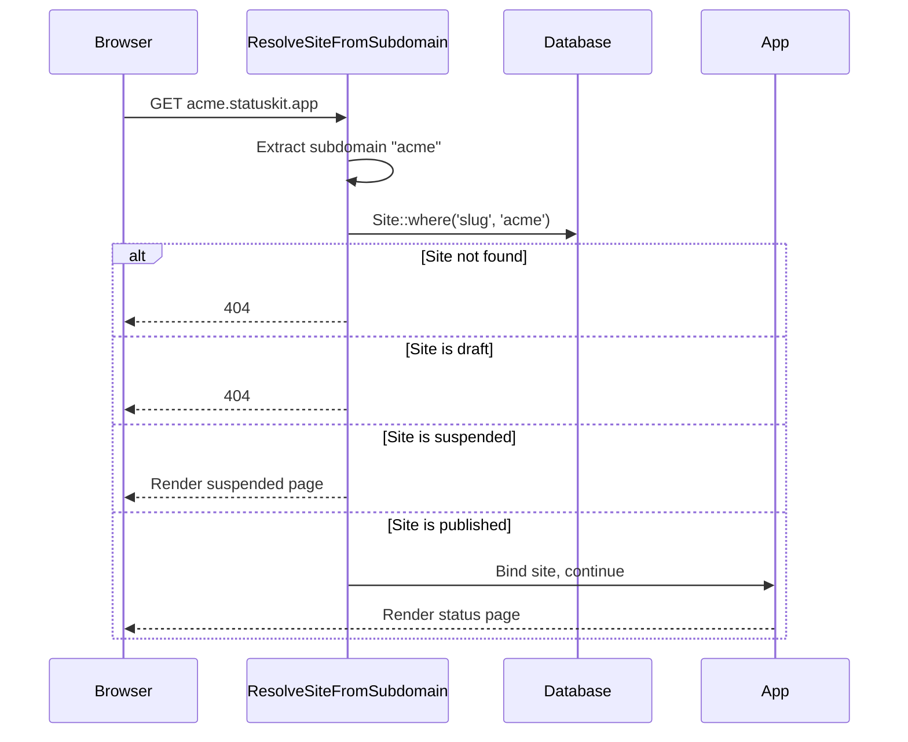
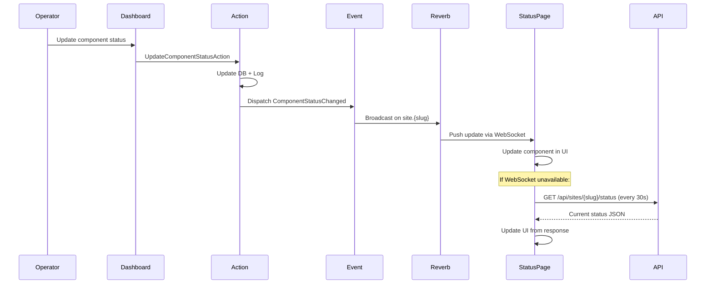

I have created the following plan after thorough exploration and analysis of the codebase. Follow the below plan verbatim. Trust the files and references. Do not re-verify what's written in the plan. Explore only when absolutely necessary. First implement all the proposed file changes and then I'll review all the changes together at the end.

---

## Observations

Phase 1 established `Site`, `Component`, `ComponentStatusLog`, `ComponentDailyUptime` with full CRUD. Phase 2 added `Incident` and `IncidentUpdate` with timeline management. Phase 3 added `MaintenanceWindow` with the `EffectiveStatusService` for deterministic public status resolution. The codebase uses Laravel Reverb for WebSockets (referenced in `composer.json`). Routes are organized by domain in separate files. The existing app renders Inertia pages in the dashboard layout. The `Site` model routes via `slug`. All controllers delegate to Actions or Services.

---

## Approach

This phase delivers the public-facing status page — the visitor-facing product surface. Each published site gets a status page served at `{slug}.statuskit.app` (subdomain-based routing). The page shows the component grid with effective statuses (via `EffectiveStatusService` from Phase 3), active incident banners, 90-day uptime history, and upcoming maintenance windows. Real-time updates flow via Laravel Reverb broadcasting on a `site.{slug}` channel with a 3-second connect timeout and silent 30-second polling fallback. A daily scheduled job computes `ComponentDailyUptime` rollups from `ComponentStatusLog` entries. Public read-only API endpoints provide the same data for programmatic consumers. This phase also creates the broadcasting events that Phase 5 (subscribers) and Phase 6 (webhooks) will listen to.

---

## - [x] 1. Middleware: ResolveSiteFromSubdomain

**`app/Http/Middleware/ResolveSiteFromSubdomain.php`**

This middleware extracts the subdomain from the incoming request host, resolves the corresponding Site, and binds it into the request and IoC container.

- Logic flow:
  1. Extract the subdomain from the request host (e.g. `acme` from `acme.statuskit.app`)
  2. If no subdomain (host equals the app domain), abort with 404
  3. Query `Site::where('slug', $subdomain)->first()`
  4. If no site found, abort with 404
  5. If site visibility is `draft`, abort with 404 (draft sites are not publicly accessible)
  6. If site visibility is `suspended`, render a suspension/unavailable page (Inertia render of `status-page/suspended`)
  7. Bind the resolved site into the request attributes and the container as `'current.site'`
  8. Proceed to the next middleware

Register as an alias `'resolve-site'` in `bootstrap/app.php` middleware aliases.



---

## - [x] 2. Events

Create broadcasting events for real-time status page updates. All events implement `ShouldBroadcastNow` for immediate delivery (not queued, since status updates should be near-instant).

**`app/Events/ComponentStatusChanged.php`**

- Constructor: `public readonly Component $component`, `public readonly ComponentStatus $previousStatus`
- Broadcasts on channel: `site.{$this->component->site->slug}` (public channel)
- Event name: `component.status_changed`
- Broadcast data: `component_id`, `name`, `status` (new effective status), `previous_status`

**`app/Events/IncidentCreated.php`**

- Constructor: `public readonly Incident $incident`
- Broadcasts on channel: `site.{$this->incident->site->slug}`
- Event name: `incident.created`
- Broadcast data: `incident_id`, `title`, `status`, `component_ids`, `initial_message`

**`app/Events/IncidentUpdated.php`**

- Constructor: `public readonly IncidentUpdate $incidentUpdate`
- Broadcasts on channel: `site.{$this->incidentUpdate->incident->site->slug}`
- Event name: `incident.updated`
- Broadcast data: `incident_id`, `status`, `message`, `created_at`

**`app/Events/IncidentResolved.php`**

- Constructor: `public readonly Incident $incident`
- Broadcasts on channel: `site.{$this->incident->site->slug}`
- Event name: `incident.resolved`
- Broadcast data: `incident_id`, `title`, `resolved_at`, `postmortem`

**`app/Events/MaintenanceScheduled.php`**

- Constructor: `public readonly MaintenanceWindow $maintenanceWindow`
- Broadcasts on channel: `site.{$this->maintenanceWindow->site->slug}`
- Event name: `maintenance.scheduled`
- Broadcast data: `maintenance_window_id`, `title`, `scheduled_at`, `ends_at`, `component_ids`

**`app/Events/MaintenanceStarted.php`**

- Constructor: `public readonly MaintenanceWindow $maintenanceWindow`
- Broadcasts on channel: `site.{$this->maintenanceWindow->site->slug}`
- Event name: `maintenance.started`
- Broadcast data: `maintenance_window_id`, `title`, `component_ids`

**`app/Events/MaintenanceCompleted.php`**

- Constructor: `public readonly MaintenanceWindow $maintenanceWindow`
- Broadcasts on channel: `site.{$this->maintenanceWindow->site->slug}`
- Event name: `maintenance.completed`
- Broadcast data: `maintenance_window_id`, `title`, `completed_at`

---

## - [x] 3. Dispatch Events from Actions

Update Phase 1, 2, and 3 Actions to dispatch the broadcasting events.

**Update `app/Actions/Sites/UpdateComponentStatusAction.php`**
- After updating the component status and logging the change, dispatch `ComponentStatusChanged` with the component and the previous status

**Update `app/Actions/Sites/CreateIncidentAction.php`**
- After creating the incident and initial update, dispatch `IncidentCreated`

**Update `app/Actions/Sites/AddIncidentUpdateAction.php`**
- After creating the update, dispatch `IncidentUpdated`

**Update `app/Actions/Sites/ResolveIncidentAction.php`**
- After resolving, dispatch `IncidentResolved`

**Update `app/Actions/Sites/ScheduleMaintenanceAction.php`**
- After creating the window, dispatch `MaintenanceScheduled`

**Update `app/Actions/Sites/CompleteMaintenanceAction.php`**
- After completing, dispatch `MaintenanceCompleted`

**Listen for maintenance start** — The `MaintenanceStarted` event should be dispatched when a maintenance window's `scheduled_at` time arrives. This is handled by the existing `CompleteExpiredMaintenanceCommand` being extended or by a new scheduled command:

**`app/Console/Commands/StartScheduledMaintenanceCommand.php`**

- Signature: `maintenance:start-scheduled`
- Description: "Dispatch events for maintenance windows that have just started"
- Logic:
  1. Query maintenance windows where `scheduled_at <= now()` AND `completed_at IS NULL` AND no `MaintenanceStarted` event has been dispatched yet (track this with a `started_at` column or by checking `scheduled_at` is within the last minute)
  2. For simplicity, add a `started_notified_at` nullable timestamp column to `maintenance_windows` via a small migration
  3. For each matching window where `started_notified_at IS NULL`, dispatch `MaintenanceStarted` and set `started_notified_at = now()`
- Schedule: `everyMinute()` in `routes/console.php`

**Migration: `add_started_notified_at_to_maintenance_windows_table`**

| Column | Type | Notes |
|---|---|---|
| `started_notified_at` | `timestamp` | `nullable()` — after `completed_at` |

---

## - [x] 4. Broadcasting Channel Configuration

**`routes/channels.php`** (create if it doesn't exist)

Register a public broadcast channel:
- Channel name: `site.{slug}`
- Authorization: return `true` (public channel — no auth required for status page visitors)

Ensure the Reverb configuration is present in `config/broadcasting.php`. The `BROADCAST_CONNECTION` env var should be set to `reverb`.

---

## - [x] 5. Service: UptimeCalculationService

**`app/Services/UptimeCalculationService.php`**

Computes daily uptime rollups from `ComponentStatusLog` entries.

- Method: `computeForDate(Component $component, Carbon $date): ComponentDailyUptime`
- Steps:
  1. Get all `ComponentStatusLog` entries for this component on the given date, ordered by `created_at` asc
  2. If no log entries exist for that day, look at the most recent entry before the day to determine the status at day start
  3. For each time segment between consecutive log entries, calculate minutes spent in each status
  4. Calculate `minutes_operational` — total minutes where effective status was `operational`
  5. Calculate `minutes_excluded_for_maintenance` — total minutes during active maintenance windows (query `MaintenanceWindow` for overlapping windows on that date)
  6. Calculate `uptime_percentage` — `minutes_operational / (total_minutes - minutes_excluded_for_maintenance) * 100`. If the denominator is zero (entire day was maintenance), set to `100.00`
  7. Upsert the `ComponentDailyUptime` record for this component and date

- Method: `computeForSite(Site $site, Carbon $date): void`
- Steps:
  1. Load all components for the site
  2. For each component, call `computeForDate($component, $date)`

---

## - [x] 6. Job & Command: ComputeDailyUptime

**`app/Jobs/ComputeDailyUptimeJob.php`**

- Implements `ShouldQueue`
- Constructor: `public readonly int $siteId`, `public readonly string $date`
- `$tries`: 3
- `$backoff`: `[60, 300]`
- `handle(UptimeCalculationService $service): void`:
  1. Load the Site
  2. Call `$service->computeForSite($site, Carbon::parse($this->date))`
- `failed(Throwable $e): void`: Log the failure

**`app/Console/Commands/ComputeDailyUptimeCommand.php`**

- Signature: `uptime:compute-daily {--date= : Date to compute, defaults to yesterday}`
- Description: "Compute daily uptime rollups for all published sites"
- Logic:
  1. Determine the date (use `--date` option or default to yesterday)
  2. Query all published sites
  3. For each site, dispatch `ComputeDailyUptimeJob` with the site ID and date
- Schedule: Daily at `00:15` (15 minutes after midnight to ensure the previous day's data is complete) in `routes/console.php`

---

## - [x] 7. Eloquent API Resources

Create API resources for the public read endpoints.

**`app/Http/Resources/PublicComponentResource.php`**

- `toArray(Request $request): array`
- Exposes: `id`, `name`, `description`, `group`, `status` (effective status, not base), `sort_order`
- Never exposes: `site_id`, `created_at`, `updated_at`

**`app/Http/Resources/PublicIncidentResource.php`**

- `toArray(Request $request): array`
- Exposes: `id`, `title`, `status`, `postmortem`, `resolved_at`, `created_at`, `components` (array of component names and IDs), `updates` (IncidentUpdate resources)
- Never exposes: `site_id`, `updated_at`

**`app/Http/Resources/PublicIncidentUpdateResource.php`**

- `toArray(Request $request): array`
- Exposes: `id`, `status`, `message`, `created_at`
- Never exposes: `incident_id`

**`app/Http/Resources/PublicMaintenanceWindowResource.php`**

- `toArray(Request $request): array`
- Exposes: `id`, `title`, `description`, `scheduled_at`, `ends_at`, `completed_at`, `components` (array of component names and IDs)
- Never exposes: `site_id`, `created_at`, `updated_at`

**`app/Http/Resources/PublicSiteStatusResource.php`**

- `toArray(Request $request): array`
- Exposes: `name`, `slug`, `description`, `overall_status`, `components` (PublicComponentResource collection), `active_incidents_count`, `meta_title`, `meta_description`, `accent_color`, `logo_path`, `favicon_path`
- Never exposes: `id`, `user_id`, `custom_css`, `custom_domain`

---

## - [x] 8. Controllers

**`app/Http/Controllers/StatusPage/PublicStatusPageController.php`**

Renders the public status page via Inertia. The site is resolved by the `ResolveSiteFromSubdomain` middleware.

- `__invoke(Request $request): Response`
  1. Retrieve the site from the container: `app('current.site')`
  2. Load components with eager loading, ordered by `sort_order`
  3. Resolve effective statuses via `EffectiveStatusService::resolveAllComponentStatuses($site)`
  4. Load open incidents with updates and components, ordered by `created_at` desc
  5. Load upcoming and active maintenance windows with components
  6. Load 90-day uptime history from `ComponentDailyUptime` for all components
  7. Compute overall site status via `EffectiveStatusService::resolveOverallSiteStatus($site)`
  8. Return `Inertia::render('status-page/index', [data])` using the public status page layout

**`app/Http/Controllers/Api/PublicApiController.php`**

Serves public read-only JSON API endpoints.

- `status(Request $request, string $slug): JsonResponse`
  1. Resolve site by slug (published only, else 404)
  2. Load components, resolve effective statuses
  3. Return `PublicSiteStatusResource` as JSON

- `incidents(Request $request, string $slug): JsonResponse`
  1. Resolve site by slug
  2. Load incidents with updates and components, paginated (20 per page)
  3. Return `PublicIncidentResource` collection

- `incident(Request $request, string $slug, int $incidentId): JsonResponse`
  1. Resolve site by slug
  2. Load the specific incident with updates and components
  3. Return `PublicIncidentResource`

- `maintenance(Request $request, string $slug): JsonResponse`
  1. Resolve site by slug
  2. Load upcoming and active maintenance windows with components
  3. Return `PublicMaintenanceWindowResource` collection

---

## - [x] 9. Routes

**Status Page Routes (subdomain-based)**

Create `routes/status-page.php`. This file uses the `resolve-site` middleware.

Register in `bootstrap/app.php` within the `withRouting.then` callback:

```
Route::middleware(['web', 'resolve-site'])
    ->domain('{slug}.' . config('app.domain'))
    ->group(base_path('routes/status-page.php'));
```

Add `APP_DOMAIN` to `.env` and `config/app.php` as `'domain' => env('APP_DOMAIN', 'statuskit.app')`.

| Method | URI | Controller | Route Name |
|---|---|---|---|
| GET | `/` | `PublicStatusPageController` | `status-page.index` |

**Public API Routes**

Create `routes/api.php` (or add to existing). These are unauthenticated, rate-limited routes.

Register in `bootstrap/app.php` within the `withRouting` configuration:

```
api: __DIR__.'/../routes/api.php',
```

| Method | URI | Controller | Route Name |
|---|---|---|---|
| GET | `api/sites/{slug}/status` | `PublicApiController@status` | `api.sites.status` |
| GET | `api/sites/{slug}/incidents` | `PublicApiController@incidents` | `api.sites.incidents` |
| GET | `api/sites/{slug}/incidents/{incident}` | `PublicApiController@incident` | `api.sites.incidents.show` |
| GET | `api/sites/{slug}/maintenance` | `PublicApiController@maintenance` | `api.sites.maintenance` |

Apply rate limiting middleware: `throttle:60,1` (60 requests per minute).

---

## - [x] 10. Config & Environment

**`config/app.php`** — add:
- `'domain' => env('APP_DOMAIN', 'statuskit.app')`

**`.env`** — add:
- `APP_DOMAIN=statuskit.app`
- `BROADCAST_CONNECTION=reverb` (ensure Reverb is the default broadcast driver)

---

## - [x] 11. TypeScript Types

Add to `resources/js/types/models.ts`:

- `PublicSiteStatus`: `name: string`, `slug: string`, `description: string | null`, `overall_status: ComponentStatus`, `components: PublicComponent[]`, `active_incidents_count: number`, `meta_title: string | null`, `meta_description: string | null`, `accent_color: string | null`, `logo_path: string | null`, `favicon_path: string | null`

- `PublicComponent`: `id: number`, `name: string`, `description: string | null`, `group: string | null`, `status: ComponentStatus`, `sort_order: number`

- `UptimeDay`: `date: string`, `uptime_percentage: number`

- `ComponentUptime`: `component_id: number`, `component_name: string`, `days: UptimeDay[]`

---

## - [x] 12. Frontend: Status Page Layout

**`resources/js/layouts/status-page-layout.tsx`**

A separate layout for public status pages (not the dashboard layout). Features:
- Site name in the header (as a title)
- Site logo if available
- Accent color applied as a CSS custom property for theming
- Clean, minimal design focused on readability
- "Powered by StatusKit" footer badge (optional, configurable)
- No authentication UI elements

---

## UI Design References

The following screenshots in `art/` show exactly how the public status page should look. Use them as pixel references when implementing the frontend in this phase.

| Screenshot | Description |
|---|---|
| `art/status-page-public.png` | Public status page (top) — large hero section with overall status icon + "All systems operational" headline + uptime % + avg response summary; Scheduled Maintenance banner; components grouped by label, each with a 90-day uptime history bar and uptime % and current status |
| `art/status-page-public-bottom.png` | Public status page (bottom) — PAST INCIDENTS section with resolved incident cards (title, duration, latest update); "Get notified" email subscription box; "Powered by StatusKit" footer |

---

## - [x] 13. Frontend Pages

**`resources/js/pages/status-page/index.tsx`**

The main public status page. Uses `status-page-layout`.

Props:
```typescript
{
  site: {
    name: string;
    slug: string;
    description: string | null;
    accent_color: string | null;
    logo_path: string | null;
    favicon_path: string | null;
    meta_title: string | null;
    meta_description: string | null;
    custom_css: string | null;
  };
  overall_status: ComponentStatus;
  components: PublicComponent[];
  effective_statuses: Record<number, ComponentStatus>;
  open_incidents: Incident[];
  upcoming_maintenance: MaintenanceWindow[];
  active_maintenance: MaintenanceWindow[];
  uptime_history: ComponentUptime[];
}
```

Page sections (top to bottom):
1. **Overall Status Banner** — Large colored banner at the top showing the overall site status (e.g. "All Systems Operational" in green, or "Major Outage" in red)
2. **Active Incident Banner** — If open incidents exist, display them prominently with title, status, and latest update. Links to the incident detail section below.
3. **Active Maintenance Banner** — If active maintenance windows exist, display them with title and affected components
4. **Component Grid** — All components listed (grouped by `group` if groups exist), each showing name and color-coded status indicator. Use the `effective_statuses` map, not the raw component status.
5. **Upcoming Maintenance** — Section listing future maintenance windows with title, time range, and affected components
6. **90-Day Uptime History** — Per-component bar chart showing daily uptime from `uptime_history`. Each day is a thin vertical bar colored green (100%), yellow (>99%), orange (>95%), or red (≤95%). Hover shows exact percentage and date.
7. **Incident History** — Reverse-chronological list of all open and recent resolved incidents with full timelines

**`resources/js/pages/status-page/suspended.tsx`**

- Simple page rendered when a suspended site is accessed
- Shows a message like "This status page is currently unavailable"
- Uses minimal styling, no site branding (since the site is suspended)

---

## - [x] 14. Frontend Components

**`resources/js/components/status-page/overall-status-banner.tsx`**

- Props: `{ status: ComponentStatus, accentColor: string | null }`
- Large banner with status text and background color matching the status

**`resources/js/components/status-page/component-grid.tsx`**

- Props: `{ components: PublicComponent[], effectiveStatuses: Record<number, ComponentStatus> }`
- Renders components grouped by `group` (or ungrouped)
- Each component shows name and a color-coded status dot + label

**`resources/js/components/status-page/incident-banner.tsx`**

- Props: `{ incidents: Incident[] }`
- Renders active incident cards with title, status, and latest update excerpt

**`resources/js/components/status-page/uptime-chart.tsx`**

- Props: `{ uptimeHistory: ComponentUptime }`
- Renders a 90-day horizontal bar chart for a single component
- Each day is a thin bar with color based on uptime percentage
- Tooltip on hover shows date and exact percentage

**`resources/js/components/status-page/incident-history.tsx`**

- Props: `{ incidents: Incident[] }`
- Renders a timeline of incidents with their updates

**`resources/js/components/status-page/maintenance-schedule.tsx`**

- Props: `{ windows: MaintenanceWindow[] }`
- Lists upcoming maintenance windows with time range and affected components

---

## - [x] 15. Real-Time Integration

The public status page connects to a Reverb WebSocket channel on load for real-time updates.

**Client-side WebSocket setup** in the status page index component:
1. On mount, attempt to connect to the `site.{slug}` Reverb channel with a 3-second connect timeout
2. If connection succeeds, listen for events:
   - `component.status_changed` — update the component's status in the local state
   - `incident.created` — add the incident to the open incidents list
   - `incident.updated` — update the incident's latest update
   - `incident.resolved` — move the incident from active to resolved
   - `maintenance.scheduled` — add to upcoming maintenance list
   - `maintenance.started` — move from upcoming to active
   - `maintenance.completed` — remove from active maintenance
3. If connection fails after 3 seconds, silently fall back to polling the `GET /api/sites/{slug}/status` endpoint every 30 seconds
4. No visible error UI for WebSocket failure — polling is a transparent fallback

Use Laravel Echo (already available via the `laravel-echo` npm package) for channel subscription. Configure Echo in a `resources/js/lib/echo.ts` file that reads the Reverb connection config from the page's meta tags or window config.

---

## - [x] 16. Tests

### Unit Tests

**`tests/Unit/Services/UptimeCalculationServiceTest.php`**

- `it computes 100% uptime when component was operational all day`
- `it computes correct uptime with status changes during the day`
- `it excludes maintenance window time from denominator`
- `it returns 100% when entire day was maintenance`
- `it uses previous day status when no logs exist for the day`
- `it handles multiple status changes in a single day`

**`tests/Unit/Events/ComponentStatusChangedTest.php`**

- `it broadcasts on the correct channel`
- `it includes correct data in broadcast payload`

### Feature Tests

**`tests/Feature/StatusPage/PublicStatusPageTest.php`**

- `it renders the status page for a published site`
- `it returns 404 for a draft site`
- `it renders suspended page for a suspended site`
- `it returns 404 for a non-existent subdomain`
- `it displays effective component statuses`
- `it shows active incidents on the status page`
- `it shows upcoming maintenance on the status page`

**`tests/Feature/Api/PublicApiTest.php`**

- `it returns site status with all components`
- `it returns effective statuses, not base statuses`
- `it returns 404 for unpublished sites`
- `it lists incidents with updates`
- `it shows a single incident with full timeline`
- `it lists upcoming maintenance windows`
- `it applies rate limiting`
- `it paginates incidents list`

**`tests/Feature/Jobs/ComputeDailyUptimeJobTest.php`**

- `it computes daily uptime for all site components`
- `it upserts existing records for the same date`
- `it handles components with no status logs`

**`tests/Feature/Commands/ComputeDailyUptimeCommandTest.php`**

- `it dispatches jobs for all published sites`
- `it uses yesterday as default date`
- `it accepts a custom date option`

**`tests/Feature/Commands/StartScheduledMaintenanceCommandTest.php`**

- `it dispatches MaintenanceStarted event for windows that just started`
- `it sets started_notified_at to prevent duplicate dispatches`
- `it ignores already notified windows`
- `it ignores future windows`

### Browser Tests

**`tests/Browser/StatusPage/PublicStatusPageTest.php`**

- `it displays the overall status banner`
  - Visit published site subdomain → see "All Systems Operational" banner
- `it shows component statuses in the grid`
  - Create site with components in different statuses → visit status page → verify each component shows correct status
- `it shows active incidents prominently`
  - Create an open incident → visit status page → see incident banner with title

---

## - [x] 17. Data Flow Diagram


