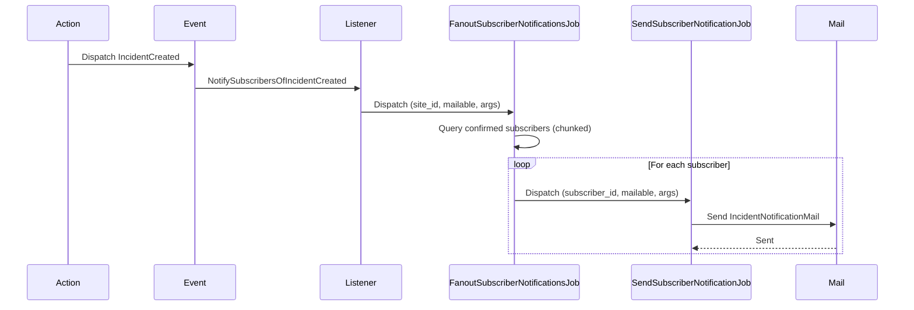
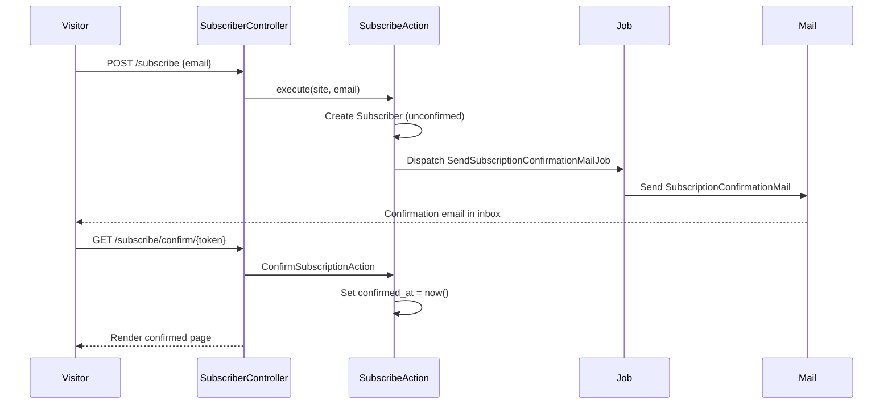

I have created the following plan after thorough exploration and analysis of the codebase. Follow the below plan verbatim. Trust the files and references. Do not re-verify what's written in the plan. Explore only when absolutely necessary. First implement all the proposed file changes and then I'll review all the changes together at the end.

---

## Observations

Phase 1–3 established the full data layer (Site, Component, Incident, IncidentUpdate, MaintenanceWindow). Phase 4 added the public status page, broadcasting events (`ComponentStatusChanged`, `IncidentCreated`, `IncidentUpdated`, `IncidentResolved`, `MaintenanceScheduled`, `MaintenanceStarted`, `MaintenanceCompleted`), and the public API. The codebase uses queued jobs for async work with `ShouldQueue`. The existing mail setup uses Laravel's built-in mail system. The `Site` model has branding fields (name, logo_path, accent_color) available for email templates. Factories use `fake()` helper.

---

## Approach

This phase adds the email subscriber system with double opt-in and event-driven notification emails. Visitors subscribe on the public status page, receive a confirmation email with a signed link, and once confirmed, receive branded emails on incident and maintenance events. All email dispatch is queued via jobs to avoid blocking the request cycle. Listeners respond to the Phase 4 broadcasting events to trigger subscriber notifications. The operator dashboard gets a subscriber management page for viewing, exporting, and removing subscribers.

---

## - [ ] 1. Migration

**`create_subscribers_table`**

| Column | Type | Notes |
|---|---|---|
| `id` | `id()` | Auto-increment primary key |
| `site_id` | `foreignId` | `constrained()->cascadeOnDelete()` |
| `email` | `string` | |
| `confirmed_at` | `timestamp` | `nullable()` — null until double opt-in confirmed |
| `token` | `string(64)` | Used for confirmation and unsubscribe links |
| `timestamps` | | |

Add a `unique(['site_id', 'email'])` composite index — one subscription per email per site.
Add an index on `token` for lookup during confirmation and unsubscribe.

---

## - [ ] 2. Model

**`app/Models/Subscriber.php`**

- Traits: `HasFactory`
- `$fillable`: `site_id`, `email`, `confirmed_at`, `token`
- `$hidden`: `['token']` — token should not be exposed in API responses
- `casts()`:
  - `confirmed_at` → `'datetime'`
- Relationships:
  - `site(): BelongsTo` → `Site::class`
- Scopes:
  - `scopeConfirmed(Builder $query): void` — filters where `confirmed_at IS NOT NULL`
  - `scopeUnconfirmed(Builder $query): void` — filters where `confirmed_at IS NULL`
- Helper methods:
  - `isConfirmed(): bool` — returns `$this->confirmed_at !== null`
  - `confirm(): void` — sets `confirmed_at` to `now()` and saves
  - `static generateToken(): string` — returns a cryptographically secure random 64-character hex string via `bin2hex(random_bytes(32))`

**Update `app/Models/Site.php`** — add relationship:
- `subscribers(): HasMany` → `Subscriber::class`

---

## - [ ] 3. Factory

**`database/factories/SubscriberFactory.php`**

Definition:
- `site_id` → `Site::factory()`
- `email` → `fake()->unique()->safeEmail()`
- `confirmed_at` → `now()` (default to confirmed)
- `token` → `Subscriber::generateToken()`

Named states:
- `unconfirmed(): static` — sets `confirmed_at` to `null`

---

## - [ ] 4. Actions

**`app/Actions/Sites/SubscribeAction.php`**

- Method: `execute(Site $site, string $email): Subscriber`
- Steps:
  1. Check if a subscriber with this email already exists for this site
  2. If the subscriber exists and is confirmed, return the existing subscriber (idempotent — no error, no duplicate)
  3. If the subscriber exists but is unconfirmed, regenerate the token, save, resend the confirmation email, and return
  4. If no subscriber exists, create a new `Subscriber` with a generated token and `confirmed_at = null`
  5. Dispatch the `SendSubscriptionConfirmationMailJob` with the subscriber
  6. Return the subscriber

**`app/Actions/Sites/ConfirmSubscriptionAction.php`**

- Method: `execute(string $token): Subscriber`
- Steps:
  1. Find the subscriber by token — if not found, throw a `ModelNotFoundException`
  2. If already confirmed, return as-is
  3. Call `$subscriber->confirm()`
  4. Return the confirmed subscriber

**`app/Actions/Sites/UnsubscribeAction.php`**

- Method: `execute(string $token): void`
- Steps:
  1. Find the subscriber by token — if not found, throw a `ModelNotFoundException`
  2. Delete the subscriber record

---

## - [ ] 5. Mailables

All mailables use the site's branding (name, logo, accent color). They extend Laravel's `Mailable` and use `ShouldQueue` via the `Queueable` trait.

**`app/Mail/SubscriptionConfirmationMail.php`**

- Constructor: `public readonly Subscriber $subscriber`
- `envelope(): Envelope`:
  - Subject: `"Confirm your subscription to {site.name} status updates"`
  - From: configured app mail address
- `content(): Content`:
  - Markdown view: `mail.subscriber.confirmation`
  - With: subscriber, site, confirmation URL (constructed from the token)
- The confirmation URL points to the public route: `GET /subscribe/confirm/{token}` on the site's subdomain

**`app/Mail/IncidentNotificationMail.php`**

- Constructor: `public readonly Subscriber $subscriber`, `public readonly Incident $incident`, `public readonly string $eventType` (created/updated/resolved)
- `envelope(): Envelope`:
  - Subject varies by event type:
    - Created: `"[{site.name}] New incident: {incident.title}"`
    - Updated: `"[{site.name}] Update on: {incident.title}"`
    - Resolved: `"[{site.name}] Resolved: {incident.title}"`
- `content(): Content`:
  - Markdown view: `mail.subscriber.incident`
  - With: subscriber (for unsubscribe link), incident, site, latest update, event type
- Unsubscribe link in footer using subscriber's token: `GET /unsubscribe/{token}`

**`app/Mail/MaintenanceNotificationMail.php`**

- Constructor: `public readonly Subscriber $subscriber`, `public readonly MaintenanceWindow $maintenanceWindow`, `public readonly string $eventType` (scheduled/reminder/started/completed)
- `envelope(): Envelope`:
  - Subject varies by event type:
    - Scheduled: `"[{site.name}] Maintenance scheduled: {window.title}"`
    - Reminder: `"[{site.name}] Maintenance starting soon: {window.title}"`
    - Started: `"[{site.name}] Maintenance started: {window.title}"`
    - Completed: `"[{site.name}] Maintenance completed: {window.title}"`
- `content(): Content`:
  - Markdown view: `mail.subscriber.maintenance`
  - With: subscriber, maintenance window, site, affected components, event type

---

## - [ ] 6. Mail Views

Create Blade markdown mail templates:

**`resources/views/mail/subscriber/confirmation.blade.php`**

- Shows site name and logo
- Message explaining they requested status update notifications
- "Confirm Subscription" button linking to the confirmation URL
- Note that they can ignore the email if they didn't subscribe

**`resources/views/mail/subscriber/incident.blade.php`**

- Shows site name and logo
- Incident title and status badge
- Latest update message and timestamp
- Link to the public status page
- Unsubscribe link in footer

**`resources/views/mail/subscriber/maintenance.blade.php`**

- Shows site name and logo
- Maintenance window title
- Time range (scheduled_at → ends_at)
- Affected components list
- Description
- Link to the public status page
- Unsubscribe link in footer

---

## - [ ] 7. Jobs

**`app/Jobs/SendSubscriptionConfirmationMailJob.php`**

- Implements `ShouldQueue`
- Constructor: `public readonly Subscriber $subscriber`
- `$tries`: 3
- `$backoff`: `[10, 60]`
- `handle(): void`:
  1. Send the `SubscriptionConfirmationMail` to the subscriber's email

**`app/Jobs/NotifySubscribersJob.php`**

- Implements `ShouldQueue`
- Constructor: `public readonly int $siteId`, `public readonly Mailable $mailable`, `public readonly string $mailableClass`, `public readonly array $mailableArgs`
- `$tries`: 3
- `$backoff`: `[10, 60, 300]`
- `handle(): void`:
  1. Query all confirmed subscribers for the site
  2. For each subscriber, construct the mailable with the subscriber and dispatch it via `Mail::to($subscriber->email)->send()`
  3. Use chunking (100 at a time) to avoid memory issues with large subscriber lists

Actually, a simpler approach — use individual jobs per subscriber to handle failures granularly:

**`app/Jobs/SendSubscriberNotificationJob.php`**

- Implements `ShouldQueue`
- Constructor: `public readonly int $subscriberId`, `public readonly string $mailableClass`, `public readonly array $mailableArgs`
- `$tries`: 3
- `$backoff`: `[10, 60, 300]`
- `handle(): void`:
  1. Load the Subscriber (if deleted, silently return — they unsubscribed)
  2. If not confirmed, silently return
  3. Instantiate the mailable class with the subscriber and the provided args
  4. Send via `Mail::to($subscriber->email)->send($mailable)`

**`app/Jobs/FanoutSubscriberNotificationsJob.php`**

- Implements `ShouldQueue`
- Constructor: `public readonly int $siteId`, `public readonly string $mailableClass`, `public readonly array $mailableArgs`
- `$tries`: 3
- `$backoff`: `[10, 60]`
- `handle(): void`:
  1. Query confirmed subscribers for the site in chunks of 100
  2. For each subscriber, dispatch `SendSubscriberNotificationJob` with the subscriber ID, mailable class, and args
  3. This two-level fanout ensures individual notification failures don't block other subscribers

---

## - [ ] 8. Listeners

Create event listeners that dispatch subscriber notification jobs when Phase 4 events fire.

**`app/Listeners/NotifySubscribersOfIncidentCreated.php`**

- Listens to: `IncidentCreated`
- `handle(IncidentCreated $event): void`:
  1. Dispatch `FanoutSubscriberNotificationsJob` with the site ID, `IncidentNotificationMail::class`, and `['incident_id' => $event->incident->id, 'event_type' => 'created']`

**`app/Listeners/NotifySubscribersOfIncidentUpdated.php`**

- Listens to: `IncidentUpdated`
- `handle(IncidentUpdated $event): void`:
  1. Dispatch `FanoutSubscriberNotificationsJob` with the site ID, `IncidentNotificationMail::class`, and `['incident_id' => $event->incidentUpdate->incident->id, 'event_type' => 'updated']`

**`app/Listeners/NotifySubscribersOfIncidentResolved.php`**

- Listens to: `IncidentResolved`
- `handle(IncidentResolved $event): void`:
  1. Dispatch `FanoutSubscriberNotificationsJob` with the site ID, `IncidentNotificationMail::class`, and `['incident_id' => $event->incident->id, 'event_type' => 'resolved']`

**`app/Listeners/NotifySubscribersOfMaintenanceScheduled.php`**

- Listens to: `MaintenanceScheduled`
- `handle(MaintenanceScheduled $event): void`:
  1. Dispatch `FanoutSubscriberNotificationsJob` with the site ID, `MaintenanceNotificationMail::class`, and `['maintenance_window_id' => $event->maintenanceWindow->id, 'event_type' => 'scheduled']`

**`app/Listeners/NotifySubscribersOfMaintenanceStarted.php`**

- Listens to: `MaintenanceStarted`
- `handle(MaintenanceStarted $event): void`:
  1. Dispatch `FanoutSubscriberNotificationsJob` with the site ID, `MaintenanceNotificationMail::class`, and `['maintenance_window_id' => $event->maintenanceWindow->id, 'event_type' => 'started']`

**`app/Listeners/NotifySubscribersOfMaintenanceCompleted.php`**

- Listens to: `MaintenanceCompleted`
- `handle(MaintenanceCompleted $event): void`:
  1. Dispatch `FanoutSubscriberNotificationsJob` with the site ID, `MaintenanceNotificationMail::class`, and `['maintenance_window_id' => $event->maintenanceWindow->id, 'event_type' => 'completed']`

---

## - [ ] 9. Event-Listener Registration

Register event-listener mappings in `app/Providers/EventServiceProvider.php` or use Laravel 12's automatic discovery (if configured). If using the EventServiceProvider:

| Event | Listener |
|---|---|
| `IncidentCreated` | `NotifySubscribersOfIncidentCreated` |
| `IncidentUpdated` | `NotifySubscribersOfIncidentUpdated` |
| `IncidentResolved` | `NotifySubscribersOfIncidentResolved` |
| `MaintenanceScheduled` | `NotifySubscribersOfMaintenanceScheduled` |
| `MaintenanceStarted` | `NotifySubscribersOfMaintenanceStarted` |
| `MaintenanceCompleted` | `NotifySubscribersOfMaintenanceCompleted` |

In Laravel 12, event discovery is enabled by default. Listeners in `app/Listeners/` are auto-discovered. Verify this by checking that there is no explicit `$listen` array overriding discovery, or register there if the project uses explicit binding.

---

## - [ ] 10. Public Controllers (Subscribe/Confirm/Unsubscribe)

**`app/Http/Controllers/StatusPage/SubscriberController.php`**

Handles the public-facing subscription endpoints on the status page subdomain.

- `store(Request $request): RedirectResponse`
  1. Validate: `email` is `['required', 'email', 'max:255']`
  2. Retrieve the site from the container: `app('current.site')`
  3. Call `SubscribeAction::execute($site, $request->validated()['email'])`
  4. Redirect back with a success flash message: "Check your email to confirm your subscription."
  5. Rate limit: Apply `throttle:5,1` middleware to prevent abuse

- `confirm(string $token): Response`
  1. Call `ConfirmSubscriptionAction::execute($token)`
  2. Return Inertia render of `status-page/subscription-confirmed` with the site
  3. If token not found, abort 404

- `unsubscribe(string $token): Response`
  1. Call `UnsubscribeAction::execute($token)`
  2. Return Inertia render of `status-page/unsubscribed` with a success message
  3. If token not found, abort 404

---

## - [ ] 11. Dashboard Controller (Subscriber Management)

**`app/Http/Controllers/Sites/SubscriberManagementController.php`**

Authenticated dashboard controller for managing subscribers.

- `index(Site $site): Response`
  1. Authorize `view` on the Site
  2. Query subscribers for the site, paginated (25 per page), ordered by `created_at` desc
  3. Include counts: total subscribers, confirmed, unconfirmed
  4. Return `Inertia::render('sites/subscribers/index', ['site' => $site, 'subscribers' => $subscribers, 'stats' => $stats])`

- `destroy(Site $site, Subscriber $subscriber): RedirectResponse`
  1. Authorize `update` on the Site
  2. Delete the subscriber
  3. Redirect back with success message

- `export(Site $site): StreamedResponse`
  1. Authorize `view` on the Site
  2. Query all confirmed subscribers for the site
  3. Stream a CSV download with columns: `email`, `confirmed_at`, `created_at`
  4. Filename: `{site.slug}-subscribers-{date}.csv`

---

## - [ ] 12. Routes

**Public subscriber routes** — Add to `routes/status-page.php` (subdomain-based, with `resolve-site` middleware):

| Method | URI | Controller | Route Name | Extra Middleware |
|---|---|---|---|---|
| POST | `/subscribe` | `SubscriberController@store` | `status-page.subscribe` | `throttle:5,1` |
| GET | `/subscribe/confirm/{token}` | `SubscriberController@confirm` | `status-page.subscribe.confirm` | |
| GET | `/unsubscribe/{token}` | `SubscriberController@unsubscribe` | `status-page.unsubscribe` | |

**Dashboard subscriber management routes** — Add to `routes/sites.php`:

| Method | URI | Controller | Route Name |
|---|---|---|---|
| GET | `dashboard/sites/{site}/subscribers` | `SubscriberManagementController@index` | `sites.subscribers.index` |
| DELETE | `dashboard/sites/{site}/subscribers/{subscriber}` | `SubscriberManagementController@destroy` | `sites.subscribers.destroy` |
| GET | `dashboard/sites/{site}/subscribers/export` | `SubscriberManagementController@export` | `sites.subscribers.export` |

---

## - [ ] 13. TypeScript Types

Add to `resources/js/types/models.ts`:

- `Subscriber`: `id: number`, `site_id: number`, `email: string`, `confirmed_at: string | null`, `created_at: string`, `updated_at: string`

- `SubscriberStats`: `total: number`, `confirmed: number`, `unconfirmed: number`

---

## UI Design References

The following screenshots in `art/` show exactly how the UI should look. Use them as pixel references when implementing all frontend pages in this phase.

| Screenshot | Description |
|---|---|
| `art/subscribers-index.png` | Subscribers index — site/filter selector in the header + "Export CSV" button; summary badges (3 active / 1 pending confirmation / 1 unsubscribed); search-by-email input; table with columns: avatar initial, Email, Status (Active / Pending / Unsubscribed with color badges), Subscribed date, Notifications tags (Incidents / Maintenance / Resolved), Remove action |
| `art/status-page-public-bottom.png` | Public status page subscribe form — "Get notified" card at the bottom of the status page with email input and Subscribe button (added in this phase) |

---

## - [ ] 14. Frontend Pages

**Public status page subscription form** — Update `resources/js/pages/status-page/index.tsx` (from Phase 4):
- Add a "Subscribe to Updates" section at the bottom of the page
- Simple email input field with a "Subscribe" button
- Uses `useForm` with `post()` to the subscribe route
- Success/error flash message display

**`resources/js/pages/status-page/subscription-confirmed.tsx`**

- Props: `{ site: { name: string } }`
- Simple confirmation page: "You're subscribed to {site.name} status updates"
- Link back to the status page

**`resources/js/pages/status-page/unsubscribed.tsx`**

- Props: `{ site: { name: string } }`
- Simple confirmation: "You've been unsubscribed from {site.name} status updates"
- Link back to the status page

**`resources/js/pages/sites/subscribers/index.tsx`** (Dashboard)

- Props: `{ site: Site, subscribers: PaginatedData<Subscriber>, stats: SubscriberStats }`
- Stats cards: total, confirmed, unconfirmed subscriber counts
- Table of subscribers: email, status (confirmed/unconfirmed), confirmed_at, created_at, delete action
- "Export CSV" button linking to the export route
- Pagination controls

---

## - [ ] 15. Tests

### Unit Tests

**`tests/Unit/Models/SubscriberTest.php`**

- `it has correct fillable attributes`
- `it hides token in serialization`
- `it casts confirmed_at to datetime`
- `it belongs to a site`
- `it scopes to confirmed subscribers`
- `it scopes to unconfirmed subscribers`
- `it reports isConfirmed correctly`
- `it confirms a subscriber`
- `it generates a secure token`

### Feature Tests

**`tests/Feature/StatusPage/SubscriberControllerTest.php`**

- `it subscribes with a valid email`
- `it rejects invalid email`
- `it creates an unconfirmed subscriber`
- `it dispatches confirmation email job`
- `it handles duplicate subscription idempotently`
- `it resends confirmation for unconfirmed duplicate`
- `it confirms a subscriber with valid token`
- `it returns 404 for invalid confirmation token`
- `it handles already confirmed subscriber`
- `it unsubscribes with valid token`
- `it returns 404 for invalid unsubscribe token`
- `it rate limits subscription attempts`

**`tests/Feature/Sites/SubscriberManagementControllerTest.php`**

- `it displays subscriber management page`
- `it shows subscriber stats`
- `it paginates subscribers`
- `it deletes a subscriber`
- `it exports subscribers as CSV`
- `it only exports confirmed subscribers`
- `it prevents managing subscribers of another users site`

**`tests/Feature/Listeners/SubscriberNotificationListenersTest.php`**

- `it dispatches fanout job when incident is created`
- `it dispatches fanout job when incident is updated`
- `it dispatches fanout job when incident is resolved`
- `it dispatches fanout job when maintenance is scheduled`
- `it dispatches fanout job when maintenance starts`
- `it dispatches fanout job when maintenance completes`

**`tests/Feature/Jobs/FanoutSubscriberNotificationsJobTest.php`**

- `it dispatches individual notification jobs for each confirmed subscriber`
- `it skips unconfirmed subscribers`
- `it handles site with no subscribers`

**`tests/Feature/Jobs/SendSubscriberNotificationJobTest.php`**

- `it sends email to subscriber`
- `it skips deleted subscribers gracefully`
- `it skips unconfirmed subscribers`

### Browser Tests

**`tests/Browser/StatusPage/SubscriptionTest.php`**

- `it allows subscribing with an email`
  - Visit status page → enter email → click subscribe → see success message
- `it confirms subscription via email link`
  - Subscribe → extract token from DB → visit confirmation URL → see confirmed page

---

## - [ ] 16. Subscriber Notification Flow

