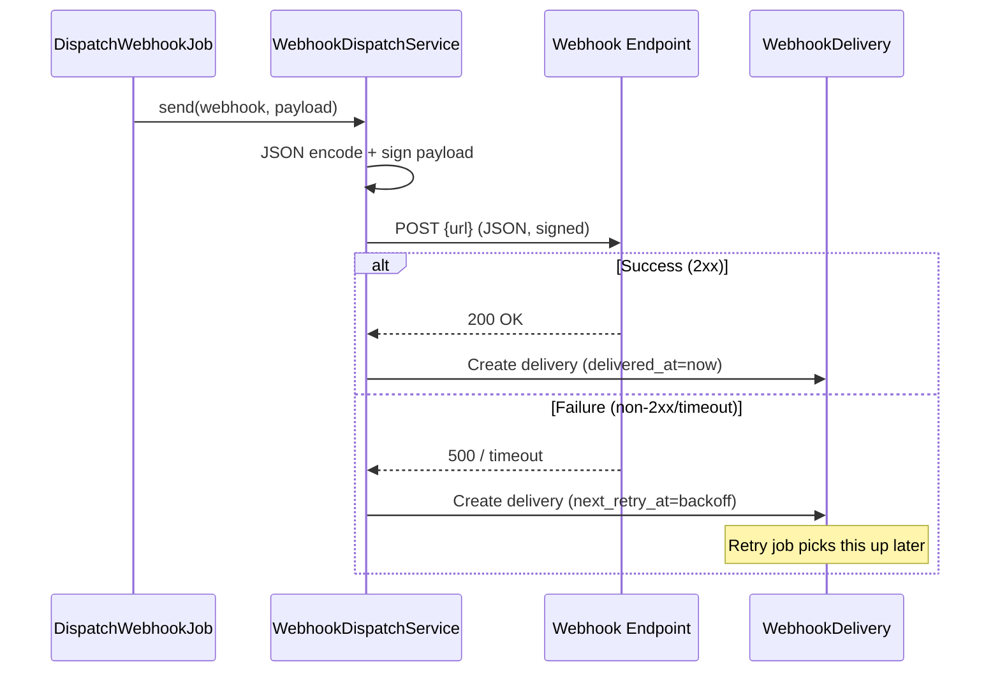
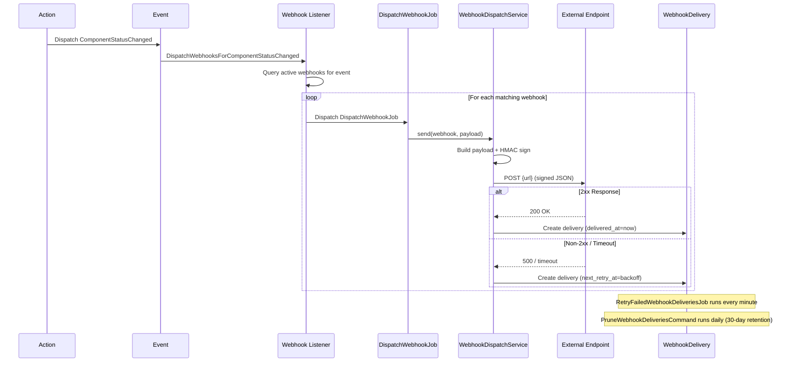
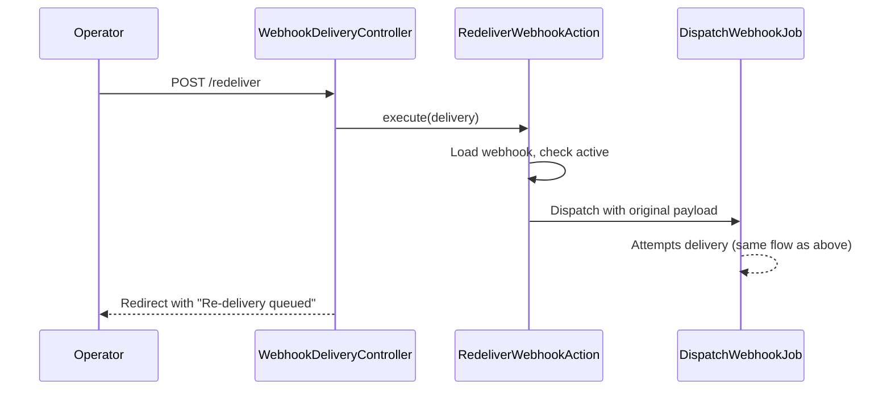

I have created the following plan after thorough exploration and analysis of the codebase. Follow the below plan verbatim. Trust the files and references. Do not re-verify what's written in the plan. Explore only when absolutely necessary. First implement all the proposed file changes and then I'll review all the changes together at the end.

---

## Observations

Phase 1–3 built the full data layer. Phase 4 established broadcasting events (`ComponentStatusChanged`, `IncidentCreated`, `IncidentUpdated`, `IncidentResolved`, `MaintenanceScheduled`, `MaintenanceStarted`, `MaintenanceCompleted`) and the public API. Phase 5 added subscriber email notifications via event listeners that respond to these same events. The codebase uses Actions for business logic and queued jobs for async work. The `Site` model has a `slug` used for routing. All models use auto-increment IDs.

---

## Approach

This phase adds the webhook system — developer-configured HTTP endpoints that receive JSON payloads when status changes, incidents, and maintenance events occur. Each webhook is signed with HMAC-SHA256 for verification. Delivery is tracked per-attempt with response codes, latency, and truncated response bodies. Failed deliveries retry up to 5 times with exponential backoff (1s → 5s → 30s → 5min → 30min). Operators manage webhooks and inspect delivery logs from the dashboard, including manual re-delivery. Webhook delivery records are retained for 30 days. Like subscriber notifications, webhooks are triggered by listening to the Phase 4 broadcasting events.

---

## - [ ] 1. Enum

**`app/Enums/WebhookEvent.php`**

| Case | Value |
|---|---|
| ComponentStatusChanged | `'component.status_changed'` |
| IncidentCreated | `'incident.created'` |
| IncidentUpdated | `'incident.updated'` |
| IncidentResolved | `'incident.resolved'` |
| MaintenanceScheduled | `'maintenance.scheduled'` |
| MaintenanceStarted | `'maintenance.started'` |
| MaintenanceCompleted | `'maintenance.completed'` |

String-backed enum. Add a `label(): string` method returning a human-readable label (e.g. `'Component Status Changed'`).

---

## - [ ] 2. Migrations

**`create_webhooks_table`**

| Column | Type | Notes |
|---|---|---|
| `id` | `id()` | Auto-increment primary key |
| `site_id` | `foreignId` | `constrained()->cascadeOnDelete()` |
| `url` | `string` | The endpoint URL to POST to |
| `secret` | `string` | HMAC-SHA256 signing secret |
| `events` | `json` | Array of `WebhookEvent` values this webhook subscribes to |
| `active` | `boolean` | `default(true)` |
| `timestamps` | | |

Add index on `['site_id', 'active']` for efficient queries.

**`create_webhook_deliveries_table`**

| Column | Type | Notes |
|---|---|---|
| `id` | `id()` | Auto-increment primary key |
| `webhook_id` | `foreignId` | `constrained()->cascadeOnDelete()` |
| `event` | `string` | The `WebhookEvent` value that triggered this delivery |
| `payload` | `json` | The full JSON payload sent |
| `response_status` | `unsignedSmallInteger` | `nullable()` — HTTP status code of the response |
| `response_body_excerpt` | `text` | `nullable()` — truncated response body (first 1000 chars) |
| `duration_ms` | `unsignedInteger` | `nullable()` — request duration in milliseconds |
| `delivered_at` | `timestamp` | `nullable()` — when successfully delivered (2xx response) |
| `attempt` | `unsignedTinyInteger` | `default(1)` — current attempt number |
| `next_retry_at` | `timestamp` | `nullable()` — when the next retry should occur |
| `timestamps` | | |

Add index on `['webhook_id', 'created_at']` for delivery log queries.
Add index on `['next_retry_at']` for retry job queries.

---

## - [ ] 3. Models

**`app/Models/Webhook.php`**

- Traits: `HasFactory`
- `$fillable`: `site_id`, `url`, `secret`, `events`, `active`
- `$hidden`: `['secret']` — secret must never be exposed in API responses or delivery logs
- `casts()`:
  - `events` → `'array'`
  - `active` → `'boolean'`
- Relationships:
  - `site(): BelongsTo` → `Site::class`
  - `deliveries(): HasMany` → `WebhookDelivery::class`
- Scopes:
  - `scopeActive(Builder $query): void` — filters where `active = true`
  - `scopeForEvent(Builder $query, WebhookEvent $event): void` — filters where the `events` JSON array contains the given event value. Use `whereJsonContains('events', $event->value)`.
- Helper methods:
  - `subscribesTo(WebhookEvent $event): bool` — returns true if the `events` array contains the given event value
  - `static generateSecret(): string` — returns a 64-character hex string via `bin2hex(random_bytes(32))`

**`app/Models/WebhookDelivery.php`**

- Traits: `HasFactory`
- `$fillable`: `webhook_id`, `event`, `payload`, `response_status`, `response_body_excerpt`, `duration_ms`, `delivered_at`, `attempt`, `next_retry_at`
- `casts()`:
  - `payload` → `'array'`
  - `delivered_at` → `'datetime'`
  - `next_retry_at` → `'datetime'`
  - `duration_ms` → `'integer'`
  - `response_status` → `'integer'`
  - `attempt` → `'integer'`
- Relationships:
  - `webhook(): BelongsTo` → `Webhook::class`
- Helper methods:
  - `isSuccessful(): bool` — returns true if `response_status` is between 200 and 299
  - `isPending(): bool` — returns true if `delivered_at IS NULL` AND `next_retry_at IS NOT NULL`
  - `isFailed(): bool` — returns true if `delivered_at IS NULL` AND `next_retry_at IS NULL` AND `attempt >= 5`
  - `maxRetriesReached(): bool` — returns true if `attempt >= 5`

**Update `app/Models/Site.php`** — add relationship:
- `webhooks(): HasMany` → `Webhook::class`

---

## - [ ] 4. Factories

**`database/factories/WebhookFactory.php`**

Definition:
- `site_id` → `Site::factory()`
- `url` → `fake()->url()`
- `secret` → `Webhook::generateSecret()`
- `events` → all `WebhookEvent` values (subscribe to everything by default)
- `active` → `true`

Named states:
- `inactive(): static` — sets `active` to `false`
- `forEvents(array $events): static` — sets `events` to the provided array of `WebhookEvent` values

**`database/factories/WebhookDeliveryFactory.php`**

Definition:
- `webhook_id` → `Webhook::factory()`
- `event` → `WebhookEvent::IncidentCreated->value`
- `payload` → `['event' => 'incident.created', 'timestamp' => now()->toIso8601String()]`
- `response_status` → `200`
- `response_body_excerpt` → `'OK'`
- `duration_ms` → `fake()->numberBetween(50, 500)`
- `delivered_at` → `now()`
- `attempt` → `1`
- `next_retry_at` → `null`

Named states:
- `failed(): static` — sets `response_status` to `500`, `response_body_excerpt` to `'Internal Server Error'`, `delivered_at` to `null`, `next_retry_at` to `now()->addMinutes(5)`, `attempt` to `3`
- `pending(): static` — sets `response_status` to `null`, `delivered_at` to `null`, `next_retry_at` to `now()->addSeconds(5)`, `attempt` to `1`
- `exhausted(): static` — sets `response_status` to `500`, `delivered_at` to `null`, `next_retry_at` to `null`, `attempt` to `5`

---

## - [ ] 5. Service: WebhookDispatchService

**`app/Services/WebhookDispatchService.php`**

Handles building payloads, signing, and sending webhook HTTP requests.

- Method: `buildPayload(WebhookEvent $event, Site $site, array $entityData): array`
- Returns:
  ```
  [
    'event' => $event->value,
    'site' => ['slug' => $site->slug, 'name' => $site->name],
    'timestamp' => now()->toIso8601String(),
    'data' => $entityData,
  ]
  ```

- Method: `sign(array $payload, string $secret): string`
- Steps:
  1. JSON-encode the payload
  2. Compute HMAC-SHA256: `hash_hmac('sha256', $jsonPayload, $secret)`
  3. Return the hex signature string

- Method: `send(Webhook $webhook, array $payload): WebhookDelivery`
- Steps:
  1. JSON-encode the payload
  2. Compute the HMAC-SHA256 signature using the webhook's secret
  3. Send an HTTP POST to `$webhook->url` with:
     - Body: JSON payload
     - Headers: `Content-Type: application/json`, `X-StatusKit-Signature: sha256={signature}`, `User-Agent: StatusKit-Webhook/1.0`
     - Timeout: 10 seconds
  4. Record the response: status code, truncated body (first 1000 characters), duration in milliseconds
  5. If response is 2xx, set `delivered_at` to `now()`, `next_retry_at` to `null`
  6. If response is non-2xx or a timeout/connection error, calculate `next_retry_at` using exponential backoff based on the attempt number
  7. Create and return the `WebhookDelivery` record
  8. Redact any authorization-related headers before persisting (do not store the signature header value in the delivery log)

- Method: `calculateBackoff(int $attempt): ?Carbon`
- Returns the next retry time based on exponential backoff:
  - Attempt 1: +1 second
  - Attempt 2: +5 seconds
  - Attempt 3: +30 seconds
  - Attempt 4: +5 minutes
  - Attempt 5: +30 minutes
  - Attempt 6+: `null` (max retries reached)



---

## - [ ] 6. Jobs

**`app/Jobs/DispatchWebhookJob.php`**

- Implements `ShouldQueue`
- Constructor: `public readonly int $webhookId`, `public readonly string $event`, `public readonly array $payload`
- `$tries`: 1 (the job itself doesn't retry — retries are managed via `WebhookDelivery.next_retry_at` and the retry command)
- `handle(WebhookDispatchService $service): void`:
  1. Load the Webhook — if not found or inactive, silently return
  2. Call `$service->send($webhook, $payload)` to attempt delivery

**`app/Jobs/RetryFailedWebhookDeliveriesJob.php`**

- Implements `ShouldQueue`
- Constructor: none (processes all pending retries)
- `handle(WebhookDispatchService $service): void`:
  1. Query `WebhookDelivery` where `delivered_at IS NULL` AND `next_retry_at <= now()` AND `attempt < 5`
  2. For each delivery, load its webhook
  3. If the webhook is inactive or deleted, set `next_retry_at = null` and save (abandon retry)
  4. Otherwise, create a new `WebhookDelivery` record with `attempt = previous_attempt + 1` and call `$service->send()` with the stored payload
  5. Process in batches of 50 to avoid memory issues

**`app/Console/Commands/RetryWebhookDeliveriesCommand.php`**

- Signature: `webhooks:retry-pending`
- Description: "Process pending webhook delivery retries"
- Logic: Dispatch `RetryFailedWebhookDeliveriesJob`
- Schedule: `everyMinute()` in `routes/console.php`

**`app/Console/Commands/PruneWebhookDeliveriesCommand.php`**

- Signature: `webhooks:prune {--days=30 : Number of days to retain}`
- Description: "Delete webhook deliveries older than the retention period"
- Logic: Delete `WebhookDelivery` where `created_at < now()->subDays($days)`
- Schedule: `daily()` in `routes/console.php`

---

## - [ ] 7. Listeners

Create event listeners that dispatch webhook jobs when events fire. These are similar to the subscriber notification listeners from Phase 5 but dispatch webhooks instead of emails.

**`app/Listeners/DispatchWebhooksForComponentStatusChanged.php`**

- Listens to: `ComponentStatusChanged`
- `handle(ComponentStatusChanged $event): void`:
  1. Load the site from the component
  2. Build the entity data: `component_id`, `name`, `status` (new), `previous_status`
  3. Query active webhooks for this site that subscribe to `WebhookEvent::ComponentStatusChanged`
  4. For each webhook, dispatch `DispatchWebhookJob` with the webhook ID, event value, and built payload

**`app/Listeners/DispatchWebhooksForIncidentCreated.php`**

- Listens to: `IncidentCreated`
- `handle(IncidentCreated $event): void`:
  1. Build entity data: incident snapshot (id, title, status, component_ids, initial message)
  2. Query webhooks subscribing to `WebhookEvent::IncidentCreated`
  3. Dispatch `DispatchWebhookJob` for each

**`app/Listeners/DispatchWebhooksForIncidentUpdated.php`**

- Listens to: `IncidentUpdated`
- Same pattern. Entity data: incident_id, update status, message, timestamp

**`app/Listeners/DispatchWebhooksForIncidentResolved.php`**

- Listens to: `IncidentResolved`
- Entity data: incident snapshot including resolved_at and postmortem

**`app/Listeners/DispatchWebhooksForMaintenanceScheduled.php`**

- Listens to: `MaintenanceScheduled`
- Entity data: maintenance window snapshot

**`app/Listeners/DispatchWebhooksForMaintenanceStarted.php`**

- Listens to: `MaintenanceStarted`
- Entity data: maintenance window snapshot

**`app/Listeners/DispatchWebhooksForMaintenanceCompleted.php`**

- Listens to: `MaintenanceCompleted`
- Entity data: maintenance window snapshot

All listeners follow the same pattern:
1. Determine the site
2. Build the payload via `WebhookDispatchService::buildPayload()`
3. Query active webhooks subscribing to the relevant event
4. Dispatch `DispatchWebhookJob` for each matching webhook

---

## - [ ] 8. Form Requests

**`app/Http/Requests/Sites/StoreWebhookRequest.php`**

| Field | Rules |
|---|---|
| `url` | `['required', 'url', 'max:2000']` |
| `events` | `['required', 'array', 'min:1']` |
| `events.*` | `['required', 'string', Rule::enum(WebhookEvent::class)]` |
| `active` | `['boolean']` |

**`app/Http/Requests/Sites/UpdateWebhookRequest.php`**

| Field | Rules |
|---|---|
| `url` | `['required', 'url', 'max:2000']` |
| `events` | `['required', 'array', 'min:1']` |
| `events.*` | `['required', 'string', Rule::enum(WebhookEvent::class)]` |
| `active` | `['boolean']` |

---

## - [ ] 9. Actions

**`app/Actions/Sites/CreateWebhookAction.php`**

- Method: `execute(Site $site, array $data): Webhook`
- Steps:
  1. Generate a signing secret via `Webhook::generateSecret()`
  2. Create the webhook: `$site->webhooks()->create([...$data, 'secret' => $secret])`
  3. Return the created Webhook

**`app/Actions/Sites/UpdateWebhookAction.php`**

- Method: `execute(Webhook $webhook, array $data): Webhook`
- Steps:
  1. Update the webhook's `url`, `events`, `active` fields (secret is NOT changed on update)
  2. Return the refreshed Webhook

**`app/Actions/Sites/DeleteWebhookAction.php`**

- Method: `execute(Webhook $webhook): void`
- Steps:
  1. Delete the webhook (cascades to deliveries)

**`app/Actions/Sites/RegenerateWebhookSecretAction.php`**

- Method: `execute(Webhook $webhook): Webhook`
- Steps:
  1. Generate a new secret via `Webhook::generateSecret()`
  2. Update the webhook's `secret`
  3. Return the refreshed Webhook with the new secret (this is the only time the secret is returned in a response)

**`app/Actions/Sites/RedeliverWebhookAction.php`**

- Method: `execute(WebhookDelivery $delivery): void`
- Steps:
  1. Load the webhook from the delivery
  2. If the webhook is inactive, throw an exception
  3. Dispatch a new `DispatchWebhookJob` with the webhook ID, the delivery's event, and the delivery's original payload
  4. This creates a new delivery attempt record on dispatch

---

## - [ ] 10. Controllers

**`app/Http/Controllers/Sites/WebhookController.php`**

Resource-style controller for managing webhooks. Authorization via SitePolicy.

- `index(Site $site): Response`
  1. Authorize `view` on the Site
  2. Query webhooks for the site with delivery stats (count total, count successful, count failed)
  3. Return `Inertia::render('sites/webhooks/index', ['site' => $site, 'webhooks' => $webhooks])`

- `create(Site $site): Response`
  1. Authorize `update` on the Site
  2. Return `Inertia::render('sites/webhooks/create', ['site' => $site, 'availableEvents' => WebhookEvent::cases()])`

- `store(StoreWebhookRequest $request, Site $site): RedirectResponse`
  1. Authorize `update` on the Site
  2. Call `CreateWebhookAction::execute($site, $request->validated())`
  3. Redirect to `sites.webhooks.index` with success message. Flash the new webhook's secret so the operator can copy it (this is the only time it's visible).

- `show(Site $site, Webhook $webhook): Response`
  1. Authorize `view` on the Site
  2. Load recent deliveries (paginated, 20 per page, ordered by `created_at` desc)
  3. Return `Inertia::render('sites/webhooks/show', ['site' => $site, 'webhook' => $webhook, 'deliveries' => $deliveries])`

- `edit(Site $site, Webhook $webhook): Response`
  1. Authorize `update` on the Site
  2. Return `Inertia::render('sites/webhooks/edit', ['site' => $site, 'webhook' => $webhook, 'availableEvents' => WebhookEvent::cases()])`

- `update(UpdateWebhookRequest $request, Site $site, Webhook $webhook): RedirectResponse`
  1. Authorize `update` on the Site
  2. Call `UpdateWebhookAction::execute($webhook, $request->validated())`
  3. Redirect back with success message

- `destroy(Site $site, Webhook $webhook): RedirectResponse`
  1. Authorize `update` on the Site
  2. Call `DeleteWebhookAction::execute($webhook)`
  3. Redirect to `sites.webhooks.index` with success message

**`app/Http/Controllers/Sites/WebhookSecretController.php`**

Invokable controller for regenerating a webhook's secret.

- `__invoke(Site $site, Webhook $webhook): RedirectResponse`
  1. Authorize `update` on the Site
  2. Call `RegenerateWebhookSecretAction::execute($webhook)`
  3. Redirect back with the new secret flashed to the session

**`app/Http/Controllers/Sites/WebhookDeliveryController.php`**

Controller for viewing delivery details and triggering re-delivery.

- `show(Site $site, Webhook $webhook, WebhookDelivery $delivery): Response`
  1. Authorize `view` on the Site
  2. Return `Inertia::render('sites/webhooks/deliveries/show', ['site' => $site, 'webhook' => $webhook, 'delivery' => $delivery])`

- `redeliver(Site $site, Webhook $webhook, WebhookDelivery $delivery): RedirectResponse`
  1. Authorize `update` on the Site
  2. Call `RedeliverWebhookAction::execute($delivery)`
  3. Redirect back with success message: "Webhook re-delivery queued"

---

## - [ ] 11. Routes

Add to `routes/sites.php`:

| Method | URI | Controller | Route Name |
|---|---|---|---|
| GET | `dashboard/sites/{site}/webhooks` | `WebhookController@index` | `sites.webhooks.index` |
| GET | `dashboard/sites/{site}/webhooks/create` | `WebhookController@create` | `sites.webhooks.create` |
| POST | `dashboard/sites/{site}/webhooks` | `WebhookController@store` | `sites.webhooks.store` |
| GET | `dashboard/sites/{site}/webhooks/{webhook}` | `WebhookController@show` | `sites.webhooks.show` |
| GET | `dashboard/sites/{site}/webhooks/{webhook}/edit` | `WebhookController@edit` | `sites.webhooks.edit` |
| PUT | `dashboard/sites/{site}/webhooks/{webhook}` | `WebhookController@update` | `sites.webhooks.update` |
| DELETE | `dashboard/sites/{site}/webhooks/{webhook}` | `WebhookController@destroy` | `sites.webhooks.destroy` |
| POST | `dashboard/sites/{site}/webhooks/{webhook}/regenerate-secret` | `WebhookSecretController` | `sites.webhooks.regenerate-secret` |
| GET | `dashboard/sites/{site}/webhooks/{webhook}/deliveries/{delivery}` | `WebhookDeliveryController@show` | `sites.webhooks.deliveries.show` |
| POST | `dashboard/sites/{site}/webhooks/{webhook}/deliveries/{delivery}/redeliver` | `WebhookDeliveryController@redeliver` | `sites.webhooks.deliveries.redeliver` |

---

## - [ ] 12. TypeScript Types

Add to `resources/js/types/models.ts`:

- `Webhook`: `id: number`, `site_id: number`, `url: string`, `events: string[]`, `active: boolean`, `created_at: string`, `updated_at: string`, `deliveries_count?: number`, `successful_deliveries_count?: number`, `failed_deliveries_count?: number`

- `WebhookDelivery`: `id: number`, `webhook_id: number`, `event: string`, `payload: Record<string, unknown>`, `response_status: number | null`, `response_body_excerpt: string | null`, `duration_ms: number | null`, `delivered_at: string | null`, `attempt: number`, `next_retry_at: string | null`, `created_at: string`, `updated_at: string`

- `WebhookEvent`: union type `'component.status_changed' | 'incident.created' | 'incident.updated' | 'incident.resolved' | 'maintenance.scheduled' | 'maintenance.started' | 'maintenance.completed'`

---

## UI Design References

The following screenshots in `art/` show exactly how the UI should look. Use them as pixel references when implementing all frontend pages in this phase.

| Screenshot | Description |
|---|---|
| `art/webhooks-index.png` | Webhooks index — list of webhooks with colored active-status dot, name, site name, endpoint URL truncated; last delivery status ("Last delivery OK" in green / "Last delivery failed" in red) with relative timestamp; disabled badge where applicable; expand chevron |
| `art/webhook-create-modal.png` | Add Webhook modal — Name input, Endpoint URL input, Secret (optional) input with HMAC-SHA256 note, Events checkboxes (Incident created/updated/resolved, Component status changed, Maintenance scheduled/started/completed), Active toggle |

---

## - [ ] 13. Frontend Pages

**`resources/js/pages/sites/webhooks/index.tsx`**

- Props: `{ site: Site, webhooks: Webhook[] }`
- Page header: "Webhooks" with "Add Webhook" button
- If a secret was flashed (new webhook created), show a dismissable alert with the secret and a copy button. Warn that it won't be shown again.
- Table/list of webhooks: URL (truncated), subscribed event count, active badge (green/gray), delivery stats (successful/failed counts)
- Each webhook links to its show page

**`resources/js/pages/sites/webhooks/create.tsx`**

- Props: `{ site: Site, availableEvents: { value: string, label: string }[] }`
- Form fields:
  - URL (text input)
  - Events (checkbox group of available webhook events)
  - Active (toggle, default on)
- Uses `useForm`, submits via `post()`

**`resources/js/pages/sites/webhooks/show.tsx`**

- Props: `{ site: Site, webhook: Webhook, deliveries: PaginatedData<WebhookDelivery> }`
- Webhook details: URL, active status, subscribed events list
- "Edit" and "Delete" buttons
- "Regenerate Secret" button with confirmation dialog
- Delivery log table: event, status badge (success/failed/pending), response code, duration, attempt number, timestamp
- Each delivery row has a "View" link and a "Redeliver" button (for failed deliveries)
- Pagination for delivery log

**`resources/js/pages/sites/webhooks/edit.tsx`**

- Props: `{ site: Site, webhook: Webhook, availableEvents: { value: string, label: string }[] }`
- Same form as create but pre-filled
- Does NOT allow editing the secret (use regenerate instead)
- Delete button with confirmation

**`resources/js/pages/sites/webhooks/deliveries/show.tsx`**

- Props: `{ site: Site, webhook: Webhook, delivery: WebhookDelivery }`
- Full delivery details:
  - Event type
  - Attempt number
  - Request payload (formatted JSON viewer)
  - Response status code
  - Response body excerpt
  - Duration
  - Delivered at / Next retry at
- "Redeliver" button

---

## - [ ] 14. Tests

### Unit Tests

**`tests/Unit/Models/WebhookTest.php`**

- `it has correct fillable attributes`
- `it hides secret in serialization`
- `it casts events to array`
- `it casts active to boolean`
- `it belongs to a site`
- `it has many deliveries`
- `it scopes to active webhooks`
- `it scopes to webhooks for a specific event`
- `it checks if webhook subscribes to an event`
- `it generates a secure secret`

**`tests/Unit/Models/WebhookDeliveryTest.php`**

- `it has correct fillable attributes`
- `it casts payload to array`
- `it casts datetime fields correctly`
- `it belongs to a webhook`
- `it reports isSuccessful correctly`
- `it reports isPending correctly`
- `it reports isFailed correctly`
- `it reports maxRetriesReached correctly`

**`tests/Unit/Services/WebhookDispatchServiceTest.php`**

- `it builds correct payload structure`
- `it signs payload with HMAC-SHA256`
- `it calculates correct backoff intervals`
- `it returns null backoff after max retries`

**`tests/Unit/Enums/WebhookEventTest.php`**

- `it has correct values for all cases`
- `it returns correct labels`

### Feature Tests

**`tests/Feature/Sites/WebhookControllerTest.php`**

- `it displays webhooks index`
- `it renders create webhook page with available events`
- `it creates a webhook with valid data`
- `it generates and flashes secret on creation`
- `it rejects invalid URL`
- `it rejects empty events array`
- `it shows webhook with delivery log`
- `it updates a webhook`
- `it deletes a webhook`
- `it regenerates webhook secret`
- `it prevents managing webhooks of another users site`

**`tests/Feature/Sites/WebhookDeliveryControllerTest.php`**

- `it shows delivery details`
- `it redelivers a webhook`
- `it prevents redelivery for inactive webhooks`
- `it prevents viewing deliveries of another users webhook`

**`tests/Feature/Jobs/DispatchWebhookJobTest.php`**

- `it sends webhook with correct payload and signature`
- `it creates delivery record on success`
- `it creates delivery record with retry on failure`
- `it skips inactive webhooks`
- `it skips deleted webhooks`
- `it truncates response body to 1000 characters`
- `it handles connection timeouts`

**`tests/Feature/Jobs/RetryFailedWebhookDeliveriesJobTest.php`**

- `it retries deliveries past their retry time`
- `it increments attempt count on retry`
- `it abandons retries for inactive webhooks`
- `it does not retry successful deliveries`
- `it does not retry exhausted deliveries`

**`tests/Feature/Listeners/WebhookDispatchListenersTest.php`**

- `it dispatches webhooks for component status changed`
- `it dispatches webhooks for incident created`
- `it dispatches webhooks for incident updated`
- `it dispatches webhooks for incident resolved`
- `it dispatches webhooks for maintenance scheduled`
- `it dispatches webhooks for maintenance started`
- `it dispatches webhooks for maintenance completed`
- `it only dispatches to webhooks subscribing to the event`
- `it skips inactive webhooks`

**`tests/Feature/Commands/PruneWebhookDeliveriesTest.php`**

- `it deletes deliveries older than retention period`
- `it retains recent deliveries`
- `it accepts custom retention days`

### Browser Tests

**`tests/Browser/Sites/WebhookManagementTest.php`**

- `it allows creating a webhook and seeing the secret`
  - Login → site → webhooks → create → fill form → submit → see secret flash → see webhook in list
- `it allows viewing the delivery log`
  - Login → site → webhook show → see delivery entries

---

## - [ ] 15. Webhook Delivery Flow




