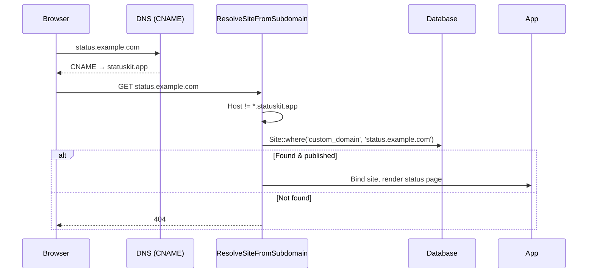
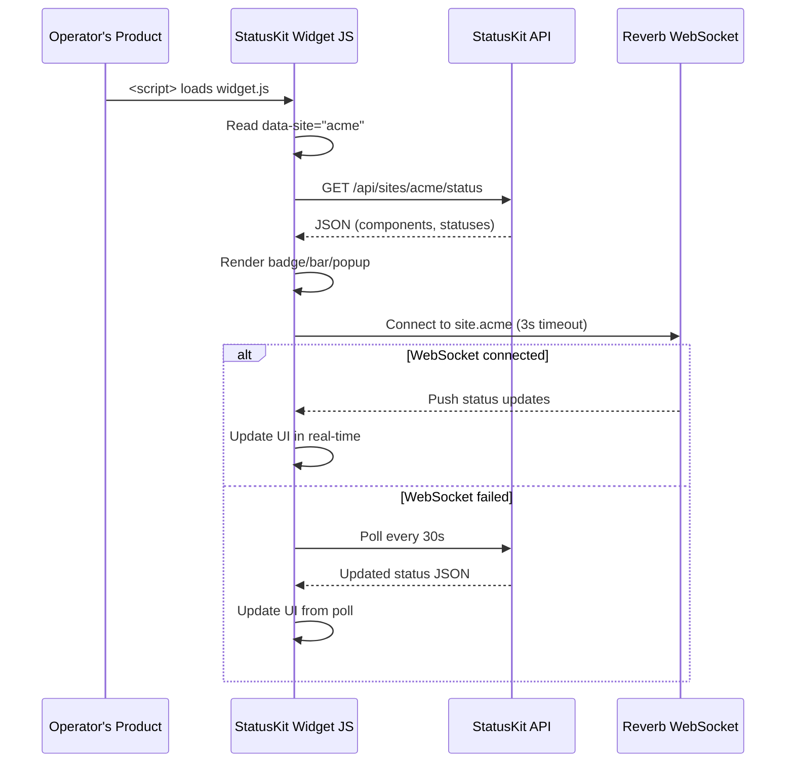

I have created the following plan after thorough exploration and analysis of the codebase. Follow the below plan verbatim. Trust the files and references. Do not re-verify what's written in the plan. Explore only when absolutely necessary. First implement all the proposed file changes and then I'll review all the changes together at the end.

---

## Observations

Phases 1–6 established the complete data layer, dashboard CRUD, broadcasting events, public status page with real-time updates, subscriber email notifications, and webhook delivery system. The `Site` model has branding fields (logo_path, favicon_path, accent_color, custom_css, meta_title, meta_description, custom_domain). The public status page renders at `{slug}.statuskit.app` via subdomain routing with the `ResolveSiteFromSubdomain` middleware. Phase 4 created the public read API endpoints at `/api/sites/{slug}/status`, `/incidents`, and `/maintenance`. The codebase uses Laravel Sanctum (present in `composer.json`) for API token authentication. Fortify handles web auth.

---

## Approach

This phase adds three capabilities: (1) an authenticated write API using Sanctum personal access tokens scoped per site, so operators can programmatically update component statuses and create incidents; (2) custom domain support via CNAME routing, allowing operators to point their own domain at StatusKit; and (3) the embeddable widget — a lightweight JavaScript snippet operators embed in their product to surface a compact status indicator. The widget connects to the same Reverb channel or falls back to polling, must be < 10KB gzipped, and requires no API key for read-only access.

---

## - [ ] 1. Migration: Personal Access Token Metadata

Sanctum's `personal_access_tokens` table already exists (shipped with Laravel). Add a migration to extend it with a `site_id` column for scoping tokens to specific sites.

**`add_site_id_to_personal_access_tokens_table`**

| Column | Type | Notes |
|---|---|---|
| `site_id` | `foreignId` | `nullable()->constrained()->nullOnDelete()` — nullable because existing tokens (if any) won't have a site scope. `nullOnDelete` so deleting a site doesn't cascade-delete the user's other tokens. |

Add an index on `site_id`.

---

## - [ ] 2. Sanctum Token Configuration

**Token Model Override**

Create `app/Models/PersonalAccessToken.php` extending `Laravel\Sanctum\PersonalAccessToken`:
- Add `$fillable`: append `'site_id'`
- Add relationship: `site(): BelongsTo` → `Site::class`
- Add scope: `scopeForSite(Builder $query, Site $site): void` — filters by `site_id`

Register the custom token model in `app/Providers/AppServiceProvider.php`:
- In `boot()`: `Sanctum::usePersonalAccessTokenModel(PersonalAccessToken::class)`

**Token Abilities**

Define token abilities (scopes) as constants or an enum:
- `component:update` — can update component status
- `incident:create` — can create incidents
- `incident:update` — can post incident updates

When creating a token, the operator selects which abilities it has and which site it's scoped to.

---

## - [ ] 3. API Token Management Actions

**`app/Actions/Sites/CreateApiTokenAction.php`**

- Method: `execute(User $user, Site $site, string $name, array $abilities): object`
- Steps:
  1. Create a Sanctum token via `$user->createToken($name, $abilities)`
  2. Set the `site_id` on the token model: `$token->accessToken->site_id = $site->id; $token->accessToken->save()`
  3. Return the token object (contains `plainTextToken` — the only time the raw token is visible)

**`app/Actions/Sites/RevokeApiTokenAction.php`**

- Method: `execute(PersonalAccessToken $token): void`
- Steps:
  1. Delete the token

---

## - [ ] 4. API Token Management Controller

**`app/Http/Controllers/Sites/ApiTokenController.php`**

Dashboard controller for managing API tokens per site.

- `index(Site $site): Response`
  1. Authorize `view` on the Site
  2. Query personal access tokens for the authenticated user scoped to this site
  3. Return `Inertia::render('sites/api-tokens/index', ['site' => $site, 'tokens' => $tokens])`

- `create(Site $site): Response`
  1. Authorize `update` on the Site
  2. Return `Inertia::render('sites/api-tokens/create', ['site' => $site, 'availableAbilities' => [...]])`

- `store(StoreApiTokenRequest $request, Site $site): RedirectResponse`
  1. Authorize `update` on the Site
  2. Call `CreateApiTokenAction::execute($request->user(), $site, $request->validated()['name'], $request->validated()['abilities'])`
  3. Redirect to `sites.api-tokens.index` flashing the `plainTextToken` (only time it's shown)

- `destroy(Site $site, int $tokenId): RedirectResponse`
  1. Authorize `update` on the Site
  2. Find the token, verify it belongs to the authenticated user and this site
  3. Call `RevokeApiTokenAction::execute($token)`
  4. Redirect back with success message

---

## - [ ] 5. Form Requests

**`app/Http/Requests/Sites/StoreApiTokenRequest.php`**

| Field | Rules |
|---|---|
| `name` | `['required', 'string', 'max:255']` |
| `abilities` | `['required', 'array', 'min:1']` |
| `abilities.*` | `['required', 'string', Rule::in(['component:update', 'incident:create', 'incident:update'])]` |

---

## - [ ] 6. Authenticated API Middleware

**`app/Http/Middleware/AuthenticateApiToken.php`**

This middleware authenticates API requests using Sanctum tokens and verifies the token is scoped to the correct site.

- Logic:
  1. Authenticate via Sanctum's `auth:sanctum` middleware (let Laravel handle Bearer token extraction)
  2. Retrieve the authenticated user's current access token
  3. Extract the `site_id` from the token
  4. Resolve the site from the route parameter `{slug}`
  5. If the token's `site_id` doesn't match the resolved site's ID, abort with 403
  6. Bind the resolved site into the container as `'current.api.site'`

Register as alias `'api-token'` in `bootstrap/app.php`.

---

## - [ ] 7. Authenticated API Controllers

**`app/Http/Controllers/Api/ComponentStatusApiController.php`**

- `__invoke(Request $request, string $slug, int $componentId): JsonResponse`
  1. Resolve the site from `'current.api.site'`
  2. Verify the token has the `component:update` ability via `$request->user()->tokenCan('component:update')`
  3. Validate: `status` field with `['required', Rule::enum(ComponentStatus::class)]`
  4. Find the component by ID within the site (404 if not found)
  5. Call `UpdateComponentStatusAction::execute($component, $validatedStatus)`
  6. Return JSON response with the updated component status

**`app/Http/Controllers/Api/IncidentApiController.php`**

- `store(Request $request, string $slug): JsonResponse`
  1. Resolve the site from `'current.api.site'`
  2. Verify `incident:create` ability
  3. Validate: `title`, `status`, `message`, `component_ids` (same rules as `StoreIncidentRequest`)
  4. Call `CreateIncidentAction::execute($site, $validatedData)`
  5. Return JSON response with the created incident (201)

**`app/Http/Controllers/Api/IncidentUpdateApiController.php`**

- `store(Request $request, string $slug, int $incidentId): JsonResponse`
  1. Resolve the site from `'current.api.site'`
  2. Verify `incident:update` ability
  3. Find the incident by ID within the site
  4. Validate: `status`, `message` (same rules as `StoreIncidentUpdateRequest`)
  5. Call `AddIncidentUpdateAction::execute($incident, $validatedData)`
  6. Return JSON response with the created update (201)

---

## - [ ] 8. API Routes

Add authenticated API routes to `routes/api.php`. These use `auth:sanctum` and the custom `api-token` middleware.

| Method | URI | Controller | Route Name |
|---|---|---|---|
| PUT | `api/v1/sites/{slug}/components/{component}/status` | `ComponentStatusApiController` | `api.v1.components.status.update` |
| POST | `api/v1/sites/{slug}/incidents` | `IncidentApiController@store` | `api.v1.incidents.store` |
| POST | `api/v1/sites/{slug}/incidents/{incident}/updates` | `IncidentUpdateApiController@store` | `api.v1.incidents.updates.store` |

Middleware group: `['auth:sanctum', 'api-token', 'throttle:120,1']`

Note: The PRD shows `/api/v1/components/{id}/status` but we use `/api/v1/sites/{slug}/components/{component}/status` to enable site-scoped token validation.

---

## - [ ] 9. Dashboard API Token Routes

Add to `routes/sites.php`:

| Method | URI | Controller | Route Name |
|---|---|---|---|
| GET | `dashboard/sites/{site}/api-tokens` | `ApiTokenController@index` | `sites.api-tokens.index` |
| GET | `dashboard/sites/{site}/api-tokens/create` | `ApiTokenController@create` | `sites.api-tokens.create` |
| POST | `dashboard/sites/{site}/api-tokens` | `ApiTokenController@store` | `sites.api-tokens.store` |
| DELETE | `dashboard/sites/{site}/api-tokens/{token}` | `ApiTokenController@destroy` | `sites.api-tokens.destroy` |

---

## - [ ] 10. Custom Domain Support

**Update `app/Http/Middleware/ResolveSiteFromSubdomain.php`** (from Phase 4)

Extend the middleware to also check for custom domains:

1. Extract the host from the request
2. Check if the host matches the app domain pattern (`{slug}.statuskit.app`) — if yes, use subdomain resolution as before
3. If the host does NOT match the app domain, query `Site::where('custom_domain', $host)->first()`
4. If found and published, bind the site and proceed
5. If found but draft/suspended, handle as before
6. If not found, abort 404

This allows operators to CNAME their domain to StatusKit and have it resolve to their site.

**Config update** — `config/app.php`:
- Ensure `'domain'` key is set (already added in Phase 4)

**Route update** — The subdomain route in `bootstrap/app.php` needs to also catch requests on custom domains. Add a second route group:

```
Route::middleware(['web', 'resolve-site'])
    ->group(base_path('routes/status-page.php'));
```

This catch-all group runs after the subdomain-specific group. The `ResolveSiteFromSubdomain` middleware handles both subdomain and custom domain resolution.

---

## - [ ] 11. Embeddable Widget

The widget is a small JavaScript file that operators embed in their product to show a compact status indicator.

**`app/Http/Controllers/Widget/WidgetController.php`**

- `script(string $slug): JavascriptResponse`
  1. Verify the site exists and is published (404 otherwise)
  2. Return a JavaScript response with inline JS that:
     - Creates a shadow DOM container for style isolation
     - Fetches current status from `GET /api/sites/{slug}/status`
     - Renders a compact status indicator (badge, bar, or popup based on `data-` attributes)
     - Attempts to connect to Reverb WebSocket channel `site.{slug}` with 3-second timeout
     - Falls back to 30-second polling if WebSocket unavailable
     - Updates the UI when status changes
  3. Set appropriate cache headers: `Cache-Control: public, max-age=300` (5-minute cache)
  4. Content-Type: `application/javascript`

**Widget Variants** (controlled via `data-` attributes on the `<script>` tag):

- `data-variant="badge"` — Minimal: status dot + label (e.g. "● All Systems Operational")
- `data-variant="bar"` — Compact bar listing components and their statuses
- `data-variant="popup"` — Floating popup that expands on click

**Configuration via `data-` attributes**:
- `data-site="{slug}"` — required, identifies the site
- `data-variant="badge|bar|popup"` — widget variant (default: badge)
- `data-position="bottom-right|bottom-left|top-right|top-left"` — position for popup variant
- `data-color="{hex}"` — override accent color

**Implementation approach**: The controller serves a static JS file (not dynamically generated per-request with a template). The JS reads `data-` attributes from its own `<script>` tag at runtime. The JS file should be pre-built as a static asset via a build step and served directly. For MVP, a single JS file compiled with Vite into `public/widget/widget.js` is sufficient.

**Widget build**:
- Create `resources/js/widget/widget.ts` — the widget source
- Add a Vite build config entry to compile it separately into `public/widget/widget.js`
- Target: < 10KB gzipped

**Widget route**:

| Method | URI | Controller | Route Name |
|---|---|---|---|
| GET | `widget/{slug}.js` | `WidgetController@script` | `widget.script` |

Add to `routes/web.php` (public, no auth). Alternatively, serve the static JS directly from `public/widget/widget.js` and have the `{slug}` extracted from `data-site` attribute at runtime (simpler — no controller needed for the JS itself, just the API).

Recommended approach: Serve the compiled widget JS as a static file at `/widget/statuskit.js`. The slug is read from the `data-site` attribute. No controller needed for the JS file.

---

## - [ ] 12. Widget Source

**`resources/js/widget/widget.ts`**

The widget entry point. Key implementation details:

1. **Self-executing**: Wraps in an IIFE that runs on script load
2. **Script tag detection**: Finds its own `<script>` tag via `document.currentScript` or `document.querySelector('script[data-site]')`
3. **Config extraction**: Reads `data-site`, `data-variant`, `data-position`, `data-color`
4. **Shadow DOM**: Creates a `<div>` with Shadow DOM for style isolation, injects minimal CSS
5. **API fetch**: Fetches `{apiBase}/api/sites/{slug}/status` where `apiBase` is derived from the script `src` URL
6. **Render**: Based on variant, renders the appropriate UI
7. **Real-time**: Attempts WebSocket connection to `{wsBase}/app/site.{slug}` with 3-second timeout
8. **Polling fallback**: If WebSocket fails, polls the status API every 30 seconds
9. **No dependencies**: Pure vanilla JS/TS, no React, no framework
10. **Size budget**: < 10KB gzipped

**Vite config update** — Add a separate build entry in `vite.config.ts`:

Add a second input for the widget build that outputs to `public/widget/statuskit.js` with no hashing (stable filename). This may require a separate Vite build config or using Vite's `lib` mode for the widget.

---

## - [ ] 13. TypeScript Types

Add to `resources/js/types/models.ts`:

- `ApiToken`: `id: number`, `name: string`, `abilities: string[]`, `last_used_at: string | null`, `created_at: string`

- `ApiTokenAbility`: union type `'component:update' | 'incident:create' | 'incident:update'`

---

## UI Design References

The following screenshots in `art/` show exactly how the UI should look. Use them as pixel references when implementing all frontend pages in this phase.

| Screenshot | Description |
|---|---|
| `art/api-tokens-index.png` | API Tokens index — table with columns: key icon + Name, Token prefix (masked `sk_live_aBcD....`), Scopes (badge pills), Last used (relative time), Expires (date or "No expiry" or "Expired" warning badge); delete action per row; "+ New token" button in header |
| `art/api-docs.png` | API Reference page — Authentication section at top with curl example; left sidebar listing endpoints by resource (Incidents, Components, Sites) with GET/POST/PATCH method badges; right panel showing selected endpoint details with Parameters table and JSON Response example |

---

## - [ ] 14. Frontend Pages

**`resources/js/pages/sites/api-tokens/index.tsx`**

- Props: `{ site: Site, tokens: ApiToken[] }`
- Page header: "API Tokens" with "Create Token" button
- If a plainTextToken was flashed, show a dismissable alert with the token value and copy button. Warn it won't be shown again.
- Table of tokens: name, abilities (as badges), last used at, created at, revoke button
- Empty state with explanation of API tokens and how to use them

**`resources/js/pages/sites/api-tokens/create.tsx`**

- Props: `{ site: Site, availableAbilities: { value: string, label: string }[] }`
- Form fields:
  - Name (text input)
  - Abilities (checkbox group)
- Uses `useForm`, submits via `post()`

**`resources/js/pages/sites/settings/widget.tsx`**

- Props: `{ site: Site }`
- Widget configuration page showing:
  - Embed code snippet (copyable): `<script src="https://statuskit.app/widget/statuskit.js" data-site="{slug}"></script>`
  - Preview of each widget variant (badge, bar, popup)
  - Configuration options: variant selector, position selector, color override
  - Updates the embed code snippet as options change

---

## - [ ] 15. Tests

### Unit Tests

**`tests/Unit/Http/Middleware/AuthenticateApiTokenTest.php`**

- `it rejects requests without a Bearer token`
- `it rejects tokens scoped to a different site`
- `it allows tokens scoped to the correct site`
- `it binds the correct site into the container`

### Feature Tests

**`tests/Feature/Api/AuthenticatedApiTest.php`**

- `it updates component status via API`
- `it rejects status update without component:update ability`
- `it rejects status update with token scoped to different site`
- `it creates an incident via API`
- `it rejects incident creation without incident:create ability`
- `it posts an incident update via API`
- `it rejects incident update without incident:update ability`
- `it returns 401 for unauthenticated requests`
- `it rate limits API requests`

**`tests/Feature/Sites/ApiTokenControllerTest.php`**

- `it displays API token management page`
- `it creates a token with selected abilities`
- `it flashes plain text token on creation`
- `it revokes a token`
- `it prevents managing tokens of another users site`

**`tests/Feature/StatusPage/CustomDomainTest.php`**

- `it resolves a site by custom domain`
- `it returns 404 for unknown custom domains`
- `it handles draft sites on custom domains`
- `it handles suspended sites on custom domains`

**`tests/Feature/Widget/WidgetTest.php`**

- `it serves the widget JavaScript file`
- `it sets appropriate cache headers`
- `it returns 404 for non-existent sites`

### Browser Tests

**`tests/Browser/Sites/ApiTokenManagementTest.php`**

- `it allows creating and revoking API tokens`
  - Login → site → API tokens → create → see token → copy → revoke → token removed

---

## - [ ] 16. Custom Domain Resolution Flow




